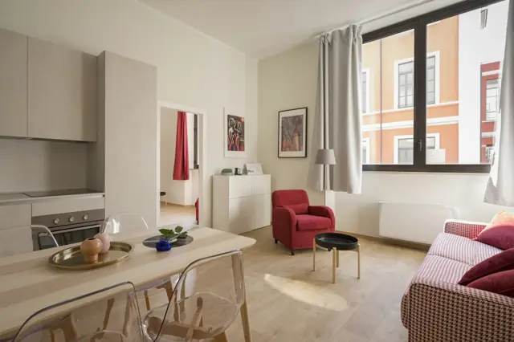
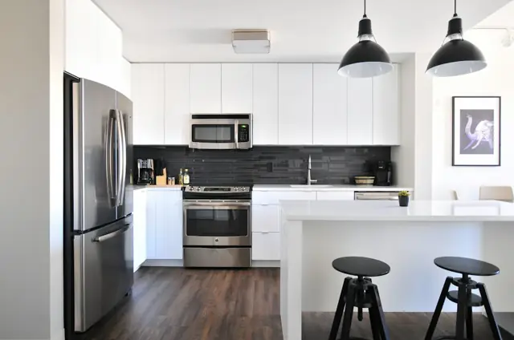

<!-- widget:cta start hero -->

# Tell agent, get discovered

Describe your product or paste a link. The agent writes your docs and keeps them found in Google and AI answers.

- What are we documenting?
- Paste a link to your website…
- Paste a link to your existing docs…
- Tell us about your product…

[Generate](https://docsbook.io/connect)

<!-- /widget -->

<!-- widget:tabs product -->

### Visibility {eye}

### Opportunities {target}

### Audit {clipboard-check}

### Issues {circle-dot}

### Pull requests {git-pull-request}

<!-- /widget -->

<!-- widget:stats cols=4 -->

- **299** — rules of documentation craft the agent checks
- **194** — published sources behind those rules
- **50** — ready-made agent workflows
- **15** — languages, each indexed on its own

<!-- /widget -->

<!-- widget:bento scroll -->

- **Tell it about your product** — Any business: a sentence, your website, a repo or a PDF is enough. The agent reads it, studies your market and your rivals, and comes back with money you are leaving on the table. {badge:Brief} {scene:chat}

  - **Software** {code}
    - **You** — We're Northstack — edge hosting, Postgres, email. Code: `github.com/northstack`.
    - **Agent** — Reading the repo · 186 endpoints, 3 SDKs {folder-git-2} {tool}
    - **Agent** — Taking your brand · `#0ea5e9` `#0f172a` Inter {palette} {tool}
    - **Agent** — Checking Google and Bing · 9,900 dev searches {tool}
    - **Agent** — Asking ChatGPT and Gemini · they name 3 rivals {tool}
    - **Agent** — Reading 2,300 issues · “add a domain?” ×148 {message-circle-question} {tool}
    - **Agent** — Comparing rivals' docs · quickstarts, playground {swords} {tool}
    - **Agent** — **+$18,400 MRR** · 460 self-serve teams at $40 {win}
    - **Agent** — 148 issues ask how to add a domain. I'm writing the quickstart, that guide and the API reference first.
  - **Apartments** {house}
    - **You** — We rent 24 apartments by the sea in Lisbon. Our site is `casamar.pt`.
    - **Agent** — Reading your site · 24 apartments, 318 photos {globe} {tool}
    - **Agent** — Taking your brand · `#0f766e` `#f59e0b` Fraunces {palette} {tool}
    - **Agent** — Checking Google and Bing · 8,100 searches {tool}
    - **Agent** — Asking ChatGPT and Gemini · they name Booking.com {tool}
    - **Agent** — Reading 412 reviews · “are pets OK?” ×37 {star} {tool}
    - **Agent** — Comparing rivals' sites · galleries and a FAQ {swords} {tool}
    - **Agent** — **+€9,800 a month** · pet owners, €140 a night {win}
    - **Agent** — You allow pets and never say so — 2,600 people a month search for it. Those pages go up first, with photos.
  - **Restaurant** {utensils}
    - **You** — We run a Mediterranean restaurant in Austin: `oliveandthyme.com`.
    - **Agent** — Reading your site · 64 dishes, 2 PDF menus {utensils} {tool}
    - **Agent** — Taking your brand · `#9a3412` `#78350f` Playfair {palette} {tool}
    - **Agent** — Checking Google · 5,400 brunch searches {tool}
    - **Agent** — Asking ChatGPT and Perplexity · 3 places, not you {tool}
    - **Agent** — Reading 860 reviews · “gluten-free?” ×52 {star} {tool}
    - **Agent** — Comparing rivals' sites · menus with photos {swords} {tool}
    - **Agent** — **+$7,300 a month** · private dining, $62 a head {win}
    - **Agent** — 1,200 people a month want a private room for 20. Yours hides in a PDF — its page goes up first, with photos.
  - **Tours** {mountain}
    - **You** — We run small-group trips in the Dolomites and beyond: `wanderco.travel`.
    - **Agent** — Reading your site · 18 trips, 540 photos {globe} {tool}
    - **Agent** — Taking your brand · `#0369a1` `#0c4a6e` Poppins {palette} {tool}
    - **Agent** — Checking Google and Bing · 12,000 searches {tool}
    - **Agent** — Asking ChatGPT and Gemini · they list GetYourGuide {tool}
    - **Agent** — Reading 1,240 reviews · “OK for kids?” ×64 {star} {tool}
    - **Agent** — Comparing rivals' sites · day-by-day plans {swords} {tool}
    - **Agent** — **+€11,200 a month** · families, €180 a seat {win}
    - **Agent** — 3,400 families a month plan Lake Braies. Your trips take kids from 6 and no page says so — that one goes first.

- **Connect the tools you already use** — GitHub, Notion, Google Sheets and Drive, Telegram, Slack. The agent reads them, keeps every page in step with them and sets its own triggers — and your team gets a second memory that answers from them. {badge:Connectors} {scene:chat}

  - **Software** {code}
    - **You** — I connected GitHub. Keep the docs in step with the code, and answer my team from it.
    - **Agent** — Connected GitHub · platform, sdk-js, cli, rfcs {logos:github-icon} {tool}
    - **Agent** — Reading `rfcs/` · 61 specs, 9 not in the docs {file-text} {tool}
    - **Agent** — Mapping `openapi.yaml` · 186 endpoints, 42 pages {braces} {tool}
    - **Agent** — Trigger: merge to `main` · rewrites touched pages {git-merge} {tool}
    - **Agent** — Trigger: a release · changelog, migration guide {rocket} {tool}
    - **Agent** — **0 stale pages** · docs follow every merge {win}
    - **Agent** — From now on, every merge to `main` rewrites the pages it touches, and every release gets its changelog. Ask me anything about Northstack — I answer from your repos.
    - **You** — How do preview deploys pick their region?
    - **Agent** — Searching your repos · platform, rfcs {search} {tool}
    - **Agent** — Reading `0042-preview-regions.md` · shipped in v3.8 {file-text} {tool}
    - **Agent** — Next to the branch's database: a preview runs in its region, or in `us-east` when the branch has none. From RFC 0042, shipped in v3.8.
  - **Apartments** {house}
    - **You** — I connected Notion — the apartments, prices and house rules are there. Take them from there and keep the site up to date.
    - **Agent** — Connected Notion · 3 databases, 24 apartments {simple-icons:notion} {tool}
    - **Agent** — Reading prices · 11 changes this season {tag} {tool}
    - **Agent** — Reading house rules · pets, check-in, parking {scroll-text} {tool}
    - **Agent** — Trigger: a price changes · page and FAQ, 12 languages {languages} {tool}
    - **Agent** — Trigger: a new apartment · its page, the same day {house-plus} {tool}
    - **Agent** — **0 stale prices** · 24 apartments, 12 languages {win}
    - **Agent** — From now on, when a price or a rule changes in Notion, the page and the FAQ follow in every language — and a new apartment gets its page the same day.
  - **Restaurant** {utensils}
    - **You** — Our menu lives in Google Sheets and holiday hours in Google Calendar. Take them from there.
    - **Agent** — Connected Google Sheets · 64 dishes, 14 allergens {simple-icons:googlesheets} {tool}
    - **Agent** — Connected Google Calendar · 3 holiday closures {calendar} {tool}
    - **Agent** — Checking allergens · 9 dishes unlabelled {wheat} {tool}
    - **Agent** — Trigger: menu edited · dishes, prices, allergens {refresh-cw} {tool}
    - **Agent** — Trigger: a holiday is set · hours on every page {calendar-clock} {tool}
    - **Agent** — **0 wrong prices** · menu, allergens and hours {win}
    - **Agent** — From now on, change a dish in the sheet or add a holiday to the calendar — the menu, the allergens and your hours follow on every page.
  - **Tours** {mountain}
    - **You** — Departures and seats are in Google Sheets, and guides drop photos into Google Drive. Keep the trips right.
    - **Agent** — Connected Google Sheets · 42 departures, seats left {simple-icons:googlesheets} {tool}
    - **Agent** — Connected Google Drive · 1,900 guide photos {logos:google-drive} {tool}
    - **Agent** — Trigger: a departure sells out · next date shown {calendar-check} {tool}
    - **Agent** — Trigger: new photos in Drive · to the trip's gallery {images} {tool}
    - **Agent** — Trigger: a guide on Telegram · weather notice up {logos:telegram} {tool}
    - **Agent** — **0 sold-out dead ends** · every trip shows a date {win}
    - **Agent** — From now on, a sold-out departure points to the next date, new photos land in the gallery, and a guide's weather call reaches the trip page in minutes.

- **It builds your site in your brand** — Photos and galleries, navigation, search, AI chat and your own domain — in the logo, colours and type from your website. Every page is written for you and lands as a change you can review. {badge:Site} {scene:browser}

  - **Software** {code}
    - `docs.northstack.dev`
    - `#0ea5e9`
    - `#0f172a`
    - `#f59e0b`
    - `Inter`
    - **Northstack**
    - **Get started**
    - **Quickstart** — Deploy an app to the edge, attach a Postgres database and send your first email — in five minutes.
    - Custom domains
    - Preview deploys
    - **API reference**
    - Deployments
    - Databases
    - Email
    - **SDKs**
    - JavaScript
    - Python
    - Go
    - **Resources**
    - Changelog
    - Migration guides
  - **Apartments** {house}
    - `casamar.pt`
    - `#0f766e`
    - `#134e4a`
    - `#f59e0b`
    - `Fraunces`
    - **Casa Mar Stays**
    - **Apartments**
    - **Sea View Villa** — Three bedrooms, a private pool and the Atlantic from every window. Pets welcome · from €240 a night.
    - Alfama Loft
    - Garden Studio
    - **Your stay**
    - Check-in and keys
    - Pets welcome
    - Free cancellation
    - [Check availability](#)
    - 
    - 
    - 
    - 
    - 
  - **Restaurant** {utensils}
    - `oliveandthyme.com`
    - `#9a3412`
    - `#78350f`
    - `#fbbf24`
    - `Playfair`
    - **Olive & Thyme**
    - **Eat with us**
    - **Private dining** — A candle-lit room for up to 24 guests, a set menu from $65 and a sommelier who stays till the end.
    - Brunch
    - Dinner menu
    - **Visit**
    - Reservations
    - Allergies and diets
    - Gift cards
    - [Book a table](#)
    - 
    - 
    - 
    - 
    - 
  - **Tours** {mountain}
    - `wanderco.travel`
    - `#0369a1`
    - `#0c4a6e`
    - `#f97316`
    - `Poppins`
    - **Wander & Co.**
    - **Trips**
    - **Lake Braies at sunrise** — A small group, a wooden boat and the lake before the crowds. Kids from 6 · from €180.
    - Cappadocia by balloon
    - Maldives, slow
    - **Plan your trip**
    - What to bring
    - Travelling with kids
    - Free cancellation
    - [Book this trip](#)
    - 
    - 
    - 
    - 
    - 

- **It gets you found and cited** — Pages built to rank on Google and to be quoted by ChatGPT, Perplexity and Claude, checked against 299 published rules. {badge:SEO & GEO} {tags}

  - Google
  - Bing
  - ChatGPT
  - Perplexity
  - Claude
  - Gemini

- **It keeps growing on its own** — Triggers wake the agent when there is money to win — a page close to a sale, a rival's new page, an unanswered question — and it comes back with the fix. {badge:Always on} {triggers}

  - **Grow the page that sells** — Weekly · sharpens the page closest to a sale {wallet} {schedule} {badge:Revenue} {gain:+$3,400/mo}
  - **Answer what buyers ask** — A question went unanswered · writes the page {message-circle-question} {event} {badge:Sales} {gain:+$2,600/mo}
  - **Win back the buyers who left** — Weekly · rewrites the page where people drop off before paying {shopping-cart} {schedule} {badge:Conversion} {gain:+$2,200/mo}
  - **Beat a rival's new page** — Daily · answers it before it ranks {swords} {schedule} {badge:Market} {gain:+$1,900/mo}
  - **Open a new market** — Monthly · finds a city or a language with demand and ships its pages {map-pin} {schedule} {badge:Growth} {gain:+$1,700/mo}
  - **Get cited by ChatGPT** — Weekly · fixes why AI answers name others {sparkles} {schedule} {badge:GEO} {gain:+$1,400/mo}
  - **Get ahead of the season** — Monthly · writes the pages people will search next month {calendar} {schedule} {badge:Season} {gain:+$1,200/mo}
  - **Win back lost traffic** — Weekly · rewrites the pages that lost readers {trending-down} {schedule} {badge:SEO} {gain:+$1,100/mo}
  - **Match a rival's price change** — Daily · updates your comparison when theirs moves {tag} {schedule} {badge:Market} {gain:+$900/mo}
  - **Fill a search gap** — Weekly · writes the page people search for {search} {schedule} {badge:SEO} {gain:+$700/mo}
  - **Launch a product the same day** — A product was added · page, photos and FAQ ready to sell {rocket} {event} {badge:Launch}
  - **Answer what reviews keep asking** — New reviews · turns repeat questions into pages {star} {event} {badge:Reviews}
  - **Translate new pages** — A page was published · ships it in 12 languages {languages} {event} {badge:Global}
  - **Catch a broken page first** — Hourly · fixes dead links and missing photos before buyers see them {shield-check} {schedule} {badge:Health}
  - **Fix what went stale** — On every merge · rewrites pages the code changed {file-pen} {github} {badge:Accuracy}
  - **Write the release notes** — On every release · turns what shipped into a page {git-merge} {github} {badge:Release}
  - **Report what the pages earned** — Every Monday · leads, bookings and the next best move {chart-no-axes-column} {schedule} {badge:Report}

<!-- /widget -->

<!-- widget:cta inbox -->

## You bring the facts. It brings the results.

The agent finds the opportunity on its own and asks your team only for the fact it cannot confirm. Then it updates the pages, measures what changed and comes back with the report — and the next opportunity.

[Learn more](./agent/review.md#what-arrives-in-the-inbox)

###  Thread #growth

- **Docsbook Agent** 10:02 AM

  **3,100 people a month** ask Google and ChatGPT if they can cancel for free before they buy. The answers name your competitors — your site never says. Can customers cancel for free? Until when?

- **Maya Chen** 10:14 AM

  Free up to 48 hours before. After that we refund 80%.

- **Docsbook Agent** 10:15 AM

  Got it. Once the pages say so, I expect **~30 more customers** a month — at your **$280 average order**, about **$8,400**.

- **Docsbook Agent** 10:15 AM

  I'll update 3 pages and check back in two weeks. I'll tell you whether it worked.

### Inbox

- **Free cancellation: +$8,400 in sales** *now* {badge:Sales} {unread}

  Two weeks ago you told me: free cancellation up to 48 hours before. I put it on 3 pages — each now answers "Can I cancel for free?" in its first line. The forecast was $8,400; here is what came in.

  **What changed** {trending-up}

  - **+$8,400** in sales from these 3 pages {wallet}
  - **+310** visitors who came ready to buy {users}
  - **+4** answers in ChatGPT and Perplexity now name you {sparkles}
  - **+38%** more people see you on Google {search}

  **Why it works** {graduation-cap}

  Google and ChatGPT show the page that answers the question plainly. Their own guides say so:

  - [Google Search guide — ranks first the page that answers the searcher's question most directly](./agent/expertise.md) {logos:google-icon}
  - [Google AI features guide — AI Overviews link pages that already answer well in Search](./agent/expertise.md) {logos:google-icon}
  - [OpenAI help center — ChatGPT search answers with links to the pages it used](./agent/expertise.md) {simple-icons:openai}

  **Next opportunity** {target}

  People also ask about discounts, and your prices page doesn't say.

  > **Asked in #growth:** do you give a discount for longer stays or bigger orders?

- **September: +$2,970 from your site** *1d* {badge:Monthly} {unread}

  Six changes shipped this month, and five moved a number.

  **What changed** {trending-up}

  - **+$2,970** new revenue from site visitors {wallet}
  - **+118** new leads {users}
  - **+3,920** visitors from Google and AI answers {search}
  - **5 of 6** forecasts came true {circle-check}

  **Best change** {trophy}

  The prices page: the share of people clicking it on Google went from **0.9%** to **3.1%** — same spot in the results.

- **Prices page: 3.4× the clicks from Google** *5d* {badge:Google}

  It sat 6th on Google and only 0.9% of people clicked. The new title and first line answer the question right away.

  - **+140** clicks a month {mouse-pointer-click}
  - **+11** new customers {users}
  - **3.1%** click rate, up from 0.9% {trending-up}

  Proof: [Google title-link guide — write a descriptive, concise title for every page](./agent/expertise.md) {logos:google-icon}

- **Payment methods: 23 questions answered, 2 sales saved** *1w* {badge:Support}

  23 visitors asked the chat which payment methods you accept. A page now answers them.

  - **0** payment questions since the page went live {message-circle}
  - **2** sales that would have been lost {wallet}
  - **1** page written {file-text}

<!-- /widget -->

<!-- widget:cta agents -->

## Give the agent a goal. It brings the customers.

One sentence from the panel, Claude Code or Cursor. The agent reads your analytics, rewrites the pages that lose you buyers, ships them as a pull request — and comes back to check that **Google and ChatGPT** now send people your way.

[Get Started](https://docsbook.io/?start=1) · [Read the quickstart](./quickstart.md)

- **Translate the docs into German and Japanese** {badge:Panel}

  *Worked for 9 min*

  42 pages in two languages, each with its own search index and sitemap.

  - **2 languages** live on your domain {languages}

- **Our pricing page shows up in Google but nobody clicks** {badge:Cursor}

  *Worked for 2 min*

  `/pricing` appears in 4,100 searches a month at position 6 with a 0.9% click rate. New title, and a first line that answers the query.

  - **Forecast** +140 clicks a month {trending-up}

- **Get us cited when buyers ask ChatGPT for a tool like ours** {badge:Claude Code}

  *Worked for 4 min*

  ChatGPT names two competitors on 5 of your buyers' questions and never you. I rewrote the pages behind those answers answer-first and opened a pull request.

  - **Changed 5 pages** `+318` `-64` {git-pull-request}
  - Checking the answers again on Oct 8 {calendar-check}

- **Turn this week's unanswered chat questions into pages** {badge:Every Monday}

  *Working…*

  23 readers asked how to set up SSO and got no answer. Writing the page they needed.

  - Drafting **Set up SSO**

- **Bring us leads from the docs, not just readers** {badge:Panel}

  *Worked for 1 min*

  The 8 pages people read to the end now close with a trial button, and every click is tracked back to the page.

  - **8 pages** now end with Get Started {mouse-pointer-click}

<!-- /widget -->

<!-- widget:cta start -->

## What are we documenting?

Describe your product or paste a link — the agent writes your first pages.

- Tell us about your product…
- Paste a link to your website…
- Paste a link to your Mintlify docs…
- Paste a link to your GitBook…

[Generate](https://docsbook.io/connect)

<!-- /widget -->
