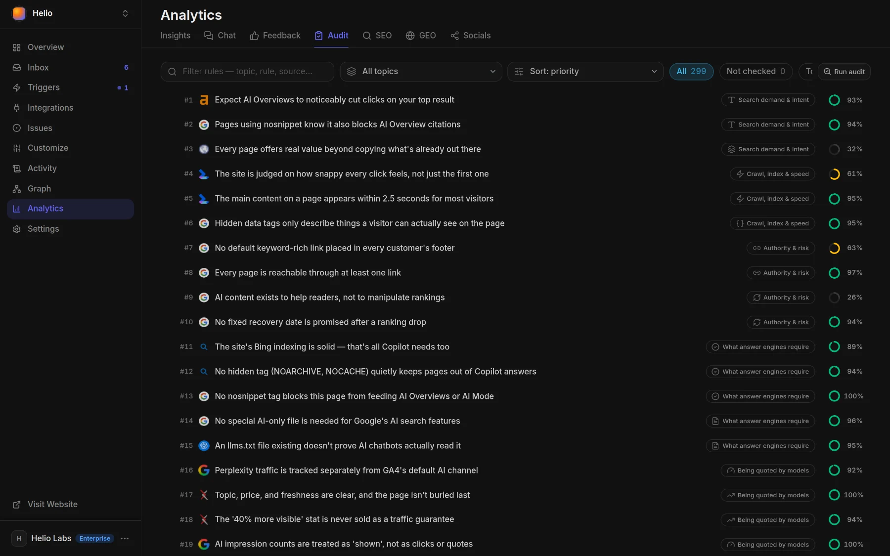

# Expertise: what the agent knows

The Docsbook agent judges your documentation against 299 rules of documentation craft, each read from a published source, and records page by page which ones your docs follow.

<!-- widget:stats cols=4 -->

- **299** — rules the agent checks
- **194** — published sources behind them
- **30** — axes, in 11 topics
- **14** — rules a machine settles by counting

<!-- /widget -->

## What is on Analytics ▸ Audit?

**Analytics ▸ Audit** is one list of all 299 rules, ranked #1 to #299 by priority for documentation as a whole.



- **Topic** — 11 topics in four groups: SEO, GEO, Writing and Socials.
- **Status** — All, Not checked, To do, Done and N/A, each with a count.
- **Sort** — by priority, or by how much of your site has been checked against the rule.
- **Search** — by topic, rule or source.
- **A row** — the publisher's icon, the rule in one plain sentence, its topic, and a coverage ring or a status. Click it to open the publication behind the rule.
- **Run audit** — hands an audit of the chosen topic to the agent. It runs the machine checks, reads your pages for the rest, and records a verdict for each rule it can judge, without editing any content.

The coverage ring shows how many of your pages were checked against the rule and how many of those pass. A rule judged on three pages out of two hundred says little yet, and the ring shows exactly that.

## Where do the rules come from?

Every rule is read from a published source, with the date the source was opened and, wherever the page can be quoted, the exact sentence the rule came from. The 194 sources are 87 vendor documents, 38 research papers, 27 standards, 21 frameworks and 21 field reports; Google Search Central, the W3C accessibility criteria and Nielsen Norman Group are cited most.

Each rule carries a standing, and the standing decides what the agent may do with it:

- **Established** — 244 rules. A vendor's own documentation, a standard or a study stands behind it. Only these become work.
- **Hypothesis** — 42 rules. Practitioners repeat it, but nothing settling stands behind it yet. The agent reads it and never turns it into a task.
- **Contested** — 13 rules. The sources disagree, and the rule says how.

| Rule | Standing | Source |
|---|---|---|
| A page carrying `nosnippet` is also kept out of AI Overviews and AI Mode | Established | Google Search Central: Robots meta tag, data-nosnippet, and X-Robots-Tag specifications |
| Titles of 51–60 characters are rewritten least often | Hypothesis | Zyppy: Google Rewrites 61% of Page Title Tags |
| AI Overviews cut clicks on the #1 result, by an amount that keeps moving | Contested | Ahrefs and Advanced Web Ranking, three measurements that disagree |

## Who decides whether a rule is met?

A verdict is per page — or per site, for site-wide rules such as `llms.txt` — and reads Done, To do or N/A; Not checked means nothing has judged it yet. Every verdict carries its evidence, and a verdict without evidence is refused. Three kinds of judge write them:

- **Machine probes** — 14 rules are settled by counting, with no model: orphan pages, vague link text, runs of prose with nothing to break them, pages without subheadings, headings and titles that open with filler, flat lists over seven items, duplicate or keyword-stuffed titles, title length, shared meta descriptions, the sitemap's size, whether crawl budget applies at all, and two checks on `llms.txt`.
- **The agent** — reads your pages for the rules no count can settle, and records a verdict only with the reading or the page behind it. A figure it quotes from a count has to match that count.
- **A merged pull request** — a change that names the rule it applies to a page records that rule as applied when it merges, with the pull request as the evidence.

Some probes can only prove a rule broken. Finding no page without subheadings does not prove the headings are specific, so a clean count leaves those rules Not checked instead of Done.

## How each axis improves your docs

The rules sit on 30 axes, each a question the agent asks of your pages. For every axis: what the agent checks, and what changes as a result.

<!-- widget:tabs -->

### SEO {search}

#### Search demand & intent

- **Intent** — checks whether a page answers what the searcher typed, in the shape that already ranks for it: a comparison, a how-to, a quick fact → the page is written for the query's dominant meaning, and a quick-fact question gets its answer in the first sentence or two.
- **Titles & snippets** — checks for duplicate or keyword-stuffed titles, shared meta descriptions, and the four defects that make Google rewrite a title: half-empty, stale, inaccurate, boilerplate → every page gets its own accurate title and description.
- **Depth** — checks whether a subject reads as covered or only mentioned, and whether a page adds anything beyond what is already published → thin pages gain the missing facets, a catch-all page splits into focused ones, and the links between them say what they point to.

#### Crawl, index & speed

- **Crawl & index** — checks that each page can be fetched, rendered and kept in the index: truthful sitemap dates, the 50,000-URL sitemap limit, single-hop redirects, real "not found" responses → when the agent moves a page, the old address redirects to the new one in a single hop, recorded in the same commit.
- **Structured data** — checks markup against the rich results Google still supports and against what is visible on the page → markup describes only what a visitor can see, and no fix is sold on the promise that markup alone moves rankings.
- **Speed** — checks pages against Google's published Core Web Vitals thresholds: LCP within 2.5 s, INP within 200 ms and CLS at 0.1 or less, at the 75th percentile → the heaviest pages are trimmed to their own content, and speed is treated as a tiebreaker between equally relevant pages.

#### Authority & risk

- **Links** — checks that every page is reachable through at least one link, and that link text names its destination → orphan pages get linked from the navigation or related pages, and "click here" becomes words that say where the link goes.
- **Spam policy** — checks for the violations Google names outright: templated pages that differ only by a name, near-duplicate variants built to rank, hidden text, integration lists copied from partners → each templated page gets at least one fact unique to its subject, and duplicate variants are merged or made distinct.
- **Core updates** — checks the whole site against what already ranks, not only the pages that dropped → after a ranking drop, pages that only restate other sources get original substance, and nobody promises a recovery date.

### GEO {globe}

#### What answer engines require

- **Eligibility** — checks for what actually keeps a page out of AI answers: `nosnippet`, a tight `max-snippet`, or Bing's `NOCACHE` → any of them on a page you want quoted is flagged, and no separate "AI version" of a page is written, because Google and Bing say none is needed.
- **AI crawlers** — checks which bots fetch your docs and what each one's token controls: model training, a search index, or a fetch a user asked for → blocking a bot is weighed by what that bot actually does, and a crawler is trusted by its published IP ranges, not by the name it sends.
- **llms.txt** — checks that `llms.txt` links to markdown copies of your pages and that `robots.txt` does not block it → the file stays a short index that points at clean markdown, and it is never sold as a way into Google's AI Overviews, which Google says need no such file.

#### Being quoted by models

- **Passages** — checks that each section answers one question on its own: its subject named, its own figures, a stable heading anchor, no table split across headings → sections open by naming their subject and carry their numbers, because an answer engine lifts a passage, not a page.
- **Content moves** — checks the edits research has actually measured: topic, price, freshness and list position decide whether a page is cited at all, and keyword stuffing scores below doing nothing → pages state their topic, price and update date plainly, and rewrites that research found useless are not made.
- **Measurement** — checks how AI visibility is read: Search Console's AI report counts impressions only, and bot visits mean different things by purpose → reports keep "an AI bot crawled us" apart from "an answer cited us", and no citation rate is invented.

### Writing {pen-line}

#### Page shape & structure

- **Page types** — checks that each page does one job: tutorial, how-to, reference or explanation → a getting-started page stops being tutorial and how-to at once, and a how-to past about ten steps splits into sub-tasks. Most rules here are hypotheses, so they arrive as advice, not tasks.
- **First screen** — checks what a reader gets before deciding to stay: the answer in the first paragraph, the key facts within two screens, titles and headings that lead with the keyword → pages open with the answer, and filler openers like "A guide to" go.
- **Navigation** — checks that a page can be found once it exists: labels in the words readers use, shortcuts through deep trees, breadcrumbs, search suggestions that return results → vague or invented section names become familiar ones, and deep sections get links that skip straight down.

#### Readability for humans

- **Plain language** — checks for sentences a reader gets through on the first pass, using readability scores as a warning sign, never as a target → tangled sentences are rewritten, without cutting the "because" a reader needed.
- **Scanning** — checks for more than two or three paragraphs with nothing to break them, sections without subheadings, headings that open with filler, and flat lists over seven items → text gets headings, lists and bold lead-ins at those intervals.
- **Accessibility** — checks the WCAG criteria a writer decides: alt text, heading order, link text, colour never the only signal, the page's language → images get alt text, headings stop skipping levels, and every link says where it goes.

#### Trust & evidence

- **E-E-A-T** — checks who stands behind a page, and whether it is accurate and open about that → pages that touch money or personal data link to a findable About or contact page, and a self-interested comparison says so.
- **Freshness** — checks whether a page that was true still is, and whether its date tells the truth → pages about changed features are updated or removed, and a date changes only when the content does.
- **Original data** — checks that factual and performance claims name their source, and whether you publish data nobody else can → claims get their citation, and your own measurements become pages of their own.

#### Language & markets

- **Translation** — checks that a translated page is translated in full, lives at its own address, links to its other language versions both ways, and is never forced on a visitor by location → no page ships a translated menu around an untranslated body.
- **How developers read** — checks against research on how developers use docs: examples that match real tasks, the answer findable mid-task, key facts not hidden on concept pages → every API operation gets a real usage example, and task pages carry both a copy-paste example and a link to the full reference.

### Socials {share-2}

The agent does not post on your behalf. On these axes it checks your pages and tells you what to do elsewhere.

#### Social distribution

- **What travels** — checks the measured properties of content that gets shared, and keeps shares apart from links → a launch plans its follow-up posts, because a post gets most of its reach in its first two hours, and a share count is never read as a sign of backlinks.
- **Per platform** — checks each platform's own published rules for how a link is shown and ranked → your pages already ship the four required Open Graph tags with a 1200×630 preview, and posts follow each platform's rules, such as keeping a page's real title on Hacker News.

#### Communities & Q&A

- **Communities** — checks where questions about your product are already asked, and whether search can see that place → a login-only Discourse forum is flagged, because nothing in it gets indexed, and tutorials stay in your docs, since Stack Overflow closes tutorial requests.
- **The rules there** — checks the published limits on promoting your own product in someone else's community → any post that mentions your product states your affiliation, and paid links carry `nofollow` or `sponsored`.

<!-- /widget -->

## Which verdicts become tasks?

A verdict becomes a task only when all three hold: the rule is established, its verdict is To do, and its priority is 1 or 2. 117 of the 299 rules can qualify, and tasks are ranked by priority, then by the lowest share of passing pages, then by how many pages they touch.

What a task is worth depends on its axis:

- **Clicks** — only for **Titles & snippets**, **Intent** and **First screen**, the three axes whose mechanism a click forecast describes. The range comes from your own Search Console data.
- **Reach** — for every other rule: the search impressions the change touches.
- **Nothing** — when there is no data, instead of an invented number.

<!-- widget:callout type=tip -->

**Why does First screen count as a click lever?** Google builds a search snippet from a page's opening text before it falls back to the meta description — and that is itself a rule in this catalog.

<!-- /widget -->

Ask the chat in your panel how your docs measure up, and the outstanding rules come back as a list you tick, each with the page it is about and the source behind it. [Find wins fast](../find-wins-fast.md) shows how a change is predicted and proved.

## Tell your agent

Press **Run audit** on **Analytics ▸ Audit**, or ask in your own words:

```text
Audit our docs against the "Crawl, index & speed" rules and record what you find.
Which established rules do our docs break, worst first? Fix the top three.
Check every page's first screen and rewrite the ones that do not answer up front.
Which pages break the Passages rules? Start with the ones the chat fails on.
```

Send it from your editor once you have [connected Docsbook](../get-discovered.md), or type it into the chat in your panel.

## FAQ

<!-- widget:accordion -->

### Is this an SEO checklist?

No. SEO is one of four groups: the 299 rules also cover answer engines, writing and socials. Each rule is graded by the source behind it, judged page by page with evidence, and only established rules at priority 1 or 2 become work.

### What does "hypothesis" mean?

A rule practitioners repeat without a vendor document, a standard or research behind it — "titles of 51–60 characters are rewritten least often" is one. The agent reads it and can tell you about it, but it never becomes a task.

### Why are most rules Not checked?

A rule stays Not checked until something judges it on your pages. 14 rules are settled by counting; the rest need the agent to read the pages, so press **Run audit** or ask the agent to check a topic.

### How do the rules stay current?

Every citation records the date the source was read, and quotes the sentence the rule came from wherever it can, so a rule can go out of date in the open. Google's FAQ rich result is an example: narrowed in 2023, then removed from Search in 2026.

<!-- /widget -->

## Next steps

<!-- widget:cards plain cols=2 arrow=hover -->

- [Find wins fast](../find-wins-fast.md) — How a broken rule becomes a predicted, measured change {target}
- [How the agent works](./README.md) — The worker that applies these rules {bot}
- [Search engines see you](../seo/README.md) — What Docsbook does for search on its own {search}
- [AI engines read and cite you](../geo/README.md) — What Docsbook does for answer engines {globe}

<!-- /widget -->
