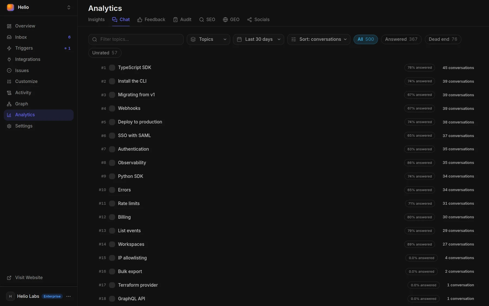
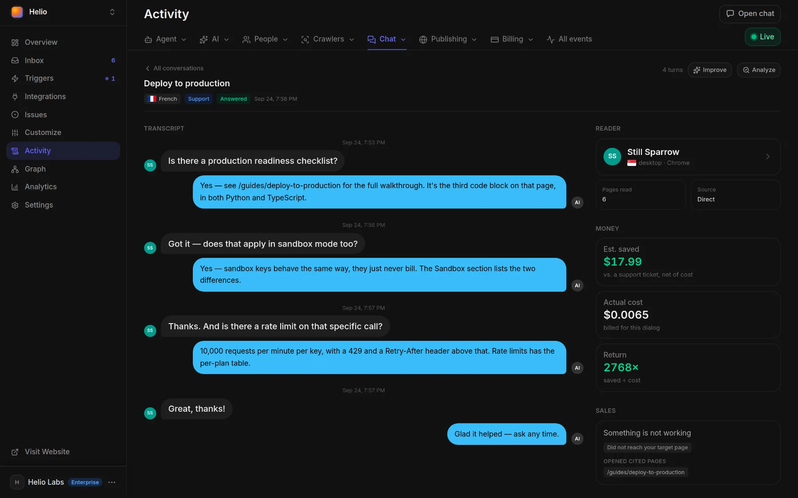

# AI answers your readers

The AI chat answers your readers' questions from your published pages, shows which pages it used, and turns every question it could not answer into work the [Docsbook agent](../agent/README.md) can pick up.

## What's on from day one

On a Pro project the chat answers readers from the first publish, with nothing to set up.

- **Where readers ask** — **Ask AI** beside the page title, the **Ask Docs** button in the bottom-right corner, and an **Ask AI** bubble on any text a reader selects are on by default. A header button (`⌘I` / `Ctrl+I`), a right-sidebar button and a bottom input bar are one switch away in [Customize](./configure.md#choose-where-readers-open-it).
- **Answers from your pages** — it searches your docs, reads up to five matching pages plus any page the reader names with `@`, and answers from those pages only.
- **Sources you can check** — the reader sees which pages it searched and read, and the answer cites them as sources.
- **An honest "I don't know"** — when the pages don't cover a question, the answer starts with "I don't know the answer to this question" and sends the reader to your **Support Email**. With no address set, it tells them to contact support and never invents one.
- **Suggested questions** — your three **Custom Questions** fill the empty chat, and each answer offers three follow-up questions.
- **One question back, when it matters** — if your pages answer differently by plan, platform or role, it asks one question with two to four options instead of guessing.
- **The page's language** — on a translated page it answers in that page's language.
- **Your call to action, when it fits** — a reader who is comparing, evaluating or asking about pricing gets one link to your **Call To Action URL**, after the answer.
- **Search beside it** — `⌘K` / `Ctrl+K` opens full-text search over your pages, and a search can go to the chat as "Can you tell me about …?".

## Which plan, and what an answer costs

Reader chat is part of **Pro** — $20 a month, with $20 of AI usage credited each month — and Enterprise. On Free the chat does not answer readers, even with your own API key; see [Plans and pricing](../pricing/plans.md).

- **Billed per answer** — each answer draws on your balance by the tokens it used, at the per-1M-token price shown beside the model on **Settings ▸ Agent ▸ AI Visitors Chat Model**.
- **Your own key** — on Enterprise, answers made with **Your own AI API Key** are billed by your provider and leave the balance alone.
- **Search is free** — full-text search is never metered.
- **An empty balance** — the chat stops answering until there is balance again.
- **Where the money went** — **Settings ▸ Usage** shows the chat on its own line, **Readers (AI chat)**.

## What the agent does on its own

Every question the chat fails on and every page a reader rates down is a signal. Switch a card on under [Triggers](../agent/triggers.md) and the Docsbook agent turns that signal into a page change, then checks whether the signal stops.

<!-- widget:cards cols=2 -->

- [Answer what the chat could not](../agent/triggers.md) — Wakes when the chat says it doesn't know. {message-circle-question}

  - **Reads:** the questions it failed on, newest first.
  - **Changes:** writes the missing page, or rewords and re-links the existing one so the next search finds it.
  - **Measures:** whether the same questions stop going unanswered.

- [Fix what readers rated down](../agent/triggers.md) — Wakes on page feedback. {thumbs-down}

  - **Reads:** the page the way the reader who voted it down read it.
  - **Changes:** adds the missing step, the assumed knowledge, the answer that was there but unfindable.
  - **Measures:** whether the page's rating recovers.

- [FAQ from real questions](../agent/triggers.md) — Runs weekly. {messages-square}

  - **Reads:** everything readers asked the chat, grouped by meaning.
  - **Changes:** answers each question where it belongs and links it from the page it was asked on; a question asked often enough becomes its own page.
  - **Measures:** how many top questions are answered without the chat, and whether they keep coming back.

- [Turn support load into pages](../agent/triggers.md) — Runs daily. {life-buoy}

  - **Reads:** the questions that keep coming back — in the chat, and in Intercom or Zendesk once connected under **Integrations**.
  - **Changes:** answers them once, in the reader's own words, on the page they were looking at.
  - **Measures:** whether those questions still arrive after the page exists.

<!-- /widget -->

The agent works from what readers actually typed: each question word for word, grouped by topic and by buying stage — evaluation, pricing, integration, support, bug — and whether the answer sent the reader on to a cited page.

- **Judged by the catalog** — each run checks the pages against the [expertise catalog](../agent/expertise.md) before and after the change; the rules these fixes turn on sit on the **First screen**, **Navigation**, **Intent** and **Passages** axes.
- **Failed searches too** — the neighbouring card **Write the pages readers wanted** works searches that found nothing the same way.
- **Cadence** — event cards wake at most once every 10 minutes; scheduled cards run daily or weekly.
- **Safe to leave on** — every change is an ordinary git commit you can [review and revert](../agent/review.md), and the pages it writes are marked for your review.
- **Cost** — trigger runs are part of Pro and draw on your balance.

## See it working

Four places show what the chat is doing, from the big picture down to one conversation.

- **Analytics ▸ Chat** — what readers asked over the last 24 hours, 7 or 30 days: by topic with each topic's answer rate, or question by question marked **Answered**, **Dead end** or **Unrated**.
- **Activity ▸ Chat** — every conversation as a row with its reader, topic, cost and outcome, plus an **Answered** column a model fills in; open a row to read the transcript.
- **Activity ▸ Agent runs** — each reader question as a **Reader chat** run with the pages it read, its tokens and its cost, beside the runs your trigger cards started.
- **Content gaps** — in Activity's **Chat** menu: questions the chat could not answer and searches that found nothing, as they happen.





## Tell your agent

Say it in one sentence — in the panel chat, or from Claude Code, Cursor or Codex through `docsbook_agent` ([Tell your agent, get discovered](../get-discovered.md)).

```text
Why did the chat say "I don't know" this week? Fix the pages it was missing.
Turn our ten most-asked chat questions into answers on the pages people ask them from.
Set our support email to help@example.com so the chat hands readers to it.
Switch on "Answer what the chat could not" and "Fix what readers rated down".
What would a reader asking about refunds be told right now?
```

## FAQ

<!-- widget:accordion -->

### Does the AI chat make things up?

It is instructed to answer only from the pages it read for that question, never from general knowledge, and to carry a page's stated requirements — a plan, a role, a prior step — into the answer. When those pages don't cover the question, it says it doesn't know and points the reader to support; [Semantic Search](./configure.md#choose-what-it-runs-on) helps it find the right page.

### Can I use my own model or API key?

Pick the model readers get on **Settings ▸ Agent ▸ AI Visitors Chat Model** (Pro); each option shows its price per 1M tokens. On Enterprise, **Your own AI API Key** takes a key from OpenRouter, OpenAI, Google Gemini, Anthropic or Vercel AI Gateway, and your provider bills you directly.

### Can I check what a reader would be told?

Yes. Ask your agent, or call `ask_project_docs`: it runs the same retrieval and model call as the chat on your site, works on every plan and is charged to your balance.

### Does the chat remember earlier questions?

No. Each question is answered on its own from the pages found for it, so a reader gets the best answer by asking the whole question.

<!-- /widget -->

## Next steps

<!-- widget:cards plain cols=2 arrow=hover -->

- [Configure the chat](./configure.md) — Prompt, questions, model and where readers open it {sliders-horizontal}
- [Chat API and hooks](./api.md) — Ask your docs from code and run your endpoints around answers {code}
- [Triggers](../agent/triggers.md) — The 49 ready-made cards, including the four above {zap}
- [Alerts and webhooks](../analytics/alerts.md) — Get pinged when the chat can't answer {bell}

<!-- /widget -->
