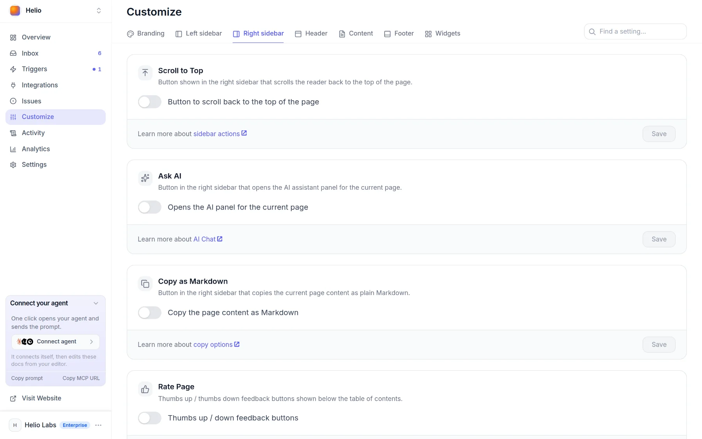
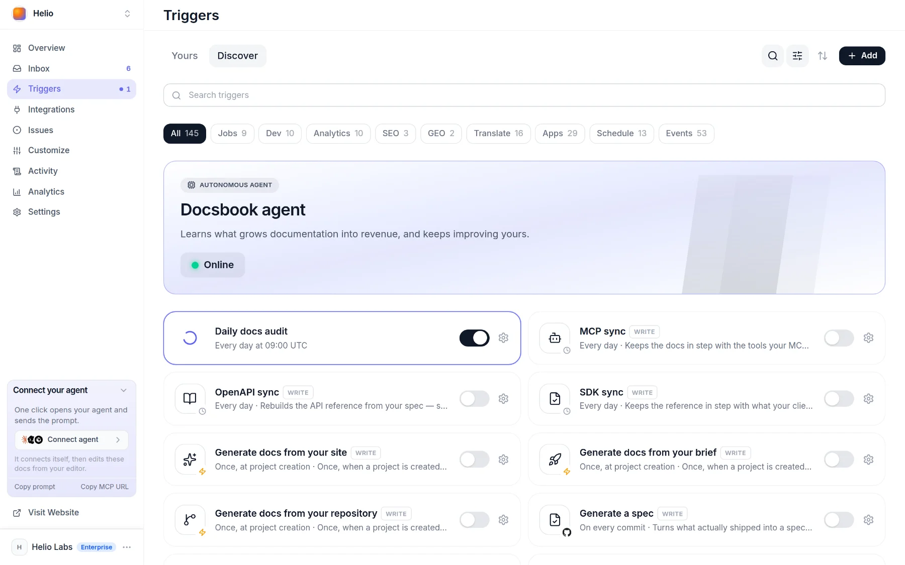
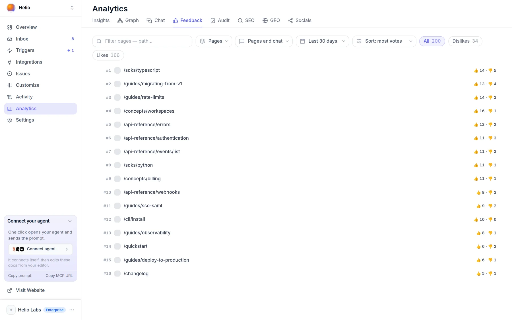

# You hear every reader

Docsbook records how readers use every page — ratings, searches, chat questions, where they give up — and its agent turns those signals into fixes you review.

## What's on from day one

Every published site collects these signals with nothing to install:

- **"Was this page helpful?"** — a Yes / No bar under every page, on by default; it is the **Rate this page** switch under **Customize ▸ Content**
- **The same question beside the outline** — off by default; turn on **Rate Page** under **Customize ▸ Right sidebar**
- **Thumbs on AI answers** — when [AI chat](../ai-chat/README.md) is on, readers like or dislike each answer, and a dislike keeps the question it answered
- **Searches that found nothing** — every query in your docs search that returned no result
- **Dead ends** — visits where a reader searched, asked the AI or opened three or more pages, then left with nothing
- **Frustration** — a page opened three times in one visit, a jump to the next page and straight back, a second search after an empty one
- **What gets read** — the headings readers scrolled to, reading time per page, where each visit starts and ends
- **People, not bots** — crawlers never count as readers, and a reader sent by an AI answer is a channel of its own

Your own testing stays out of reader metrics too: visits from a network where you have the project open in the panel are left out.



## What the agent does on its own

Each signal can wake the [Docsbook agent](../agent/README.md) through a ready-made card under **Triggers**. Switch a card on and every run follows one loop:

1. **A reader signal arrives** — a downvote, an empty search, a week of exits
2. **The agent reads the evidence** against the rules of the [expertise catalog](../agent/expertise.md)
3. **It changes the docs** in a [pull request](../agent/review.md), or files an issue when the finding needs your decision
4. **It names the number to check** — later the pull request reports **As predicted**, **No effect**, **Went backwards** or **Cannot tell**



<!-- widget:cards cols=2 -->

- [Fix what readers rated down](../agent/triggers.md) — Wakes when a reader rates a page. {thumbs-down}

  Reads the page as the reader who voted and fixes what it failed to say: a missing step, assumed knowledge, an answer buried too deep. Checks whether the page's rating recovers.

- [Write the pages readers wanted](../agent/triggers.md) — Wakes when a search finds nothing. {search-x}

  Writes the page readers searched for, or fixes the naming and navigation when the answer exists under another name. Checks whether those queries stop failing.

- [Fix the dead ends](../agent/triggers.md) — Runs weekly. {signpost}

  Finds the pages readers leave without clicking anything and adds the next step: a missing page, a link, the other half of the answer. Checks whether the worst exit pages stop being the worst.

- [File the search gaps](../agent/triggers.md) — Runs daily. {list-ordered}

  Groups failed searches and unanswered chat questions, ranks them by how many readers hit each, and files one issue. Writes no pages on this run.

- [Weekly docs digest](../agent/triggers.md) — Runs weekly. {newspaper}

  Files one issue: what changed, what readers came for, where they failed to find it, and the two or three things worth doing next, each with its number.

- [Explain a traffic drop](../agent/triggers.md) — Runs weekly. {trending-down}

  Compares traffic per page and per source with earlier periods and names the pages that lost readers. Fixes a cause on your side, such as a removed page or a broken link; reports anything else with the numbers.

- [Turn support load into pages](../agent/triggers.md) — Runs daily. {life-buoy}

  Finds the questions support answers over and over and answers each one on the page readers were on. Connect Intercom or Zendesk under **Integrations** to give it the tickets.

<!-- /widget -->

Once a change merges, its pull request shows **Reads**, **Dead ends**, **Rank** and **AI spend** for the pages it touched, after the merge against before. Those pages are measured against the pages the change did not touch, so a site-wide swing is not credited to the edit.

The catalog's **First screen**, **Navigation**, **Intent** and **Scanning** axes hold the rules for these fixes. One of them: readers spend 74% of their viewing time on the first two screenfuls of a page (Nielsen Norman Group), so an answer below them is an answer most readers miss.

## See it working

These screens in the panel show the signals above:

- **Analytics ▸ Feedback** — each rated page with its thumbs-up and thumbs-down counts; switch the view to **Votes** for every vote with its date, or narrow to **Page thumbs** or **Chat answers**
- **Analytics ▸ Chat** — what readers asked the AI chat, by topic, each conversation marked **Answered**, **Dead end** or **Unrated**
- **Activity ▸ Chat ▸ Content gaps** — each search that found nothing and each question the chat could not answer, as it happens
- **Analytics ▸ Graph** — your docs as a map; colour it by **Dead ends** to see which pages end visits
- **Analytics ▸ Insights** — traffic, sources, audience and conversions, covered in [Docs analytics](./insights.md)
- **Activity ▸ Readers ▸ Users** — one row per reader: country, the translation they read, where they came from, the [goals](./goals.md) they reached



<!-- widget:callout type=tip -->

Hear about a downvote or an empty search the moment it happens: send it to Slack, email or your own webhook with [Alerts](./alerts.md).

<!-- /widget -->

## Tell your agent

Say it in one sentence to `docsbook_agent` from Claude Code, Cursor or Codex, or in the panel chat. [Tell your agent, get discovered](../get-discovered.md) shows how to connect.

```text
Which pages did readers rate down this month? Fix the worst one.
Turn the searches that found nothing into pages.
Find where readers give up, and give those pages a next step.
When a reader rates a page down, fix the page.
Why did traffic drop last week?
```

## FAQ

<!-- widget:accordion -->

### Does Docsbook set cookies to track readers?

No. Analytics counts a reader by a salted hash of their IP address, scoped to your project, so a reader appears as a pseudonym, never a name, and the same person on two Docsbook sites is not linked.

### Can readers say why they rated a page down?

Not in words: the page rating is Yes or No. That is why the agent reads the page as the voter would have and works out what it failed to say — and why a dislike on an AI answer keeps the question it answered.

### Will a burst of downvotes start dozens of agent runs?

No. An event card runs at most once every 10 minutes, and each run works through everything that arrived since the last one.

### How far back does the data go?

30 days. Every report in the panel reads within the last 30 days of recorded visits.

<!-- /widget -->

## Next steps

<!-- widget:cards plain cols=2 arrow=hover -->

- [Docs analytics](./insights.md) — Traffic, AI visitors and revenue per page {chart-line}
- [Goals and funnels](./goals.md) — Declare what a reader should do, and count who did {target}
- [Alerts and webhooks](./alerts.md) — A message the moment a reader downvotes or finds nothing {bell}
- [Triggers](../agent/triggers.md) — The ready-made cards that wake the agent {zap}

<!-- /widget -->
