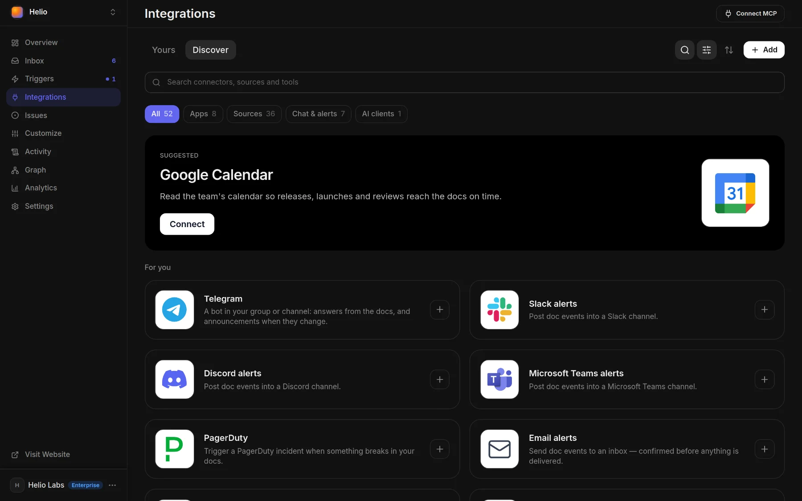

# Alerts and webhooks

Docsbook records every event your docs produce and can send each one to Slack, Discord, Microsoft Teams, PagerDuty, email, a Claude Code routine or your own HTTPS endpoint — signed, retried and replayable.

## Set up an alert

<!-- widget:stepper -->

Alerts work on every plan, and deliveries are never metered.

### Open the destination on Integrations

Open **Integrations**, search the catalog and open the destination's card:



- **Slack alerts**, **Discord alerts** or **Microsoft Teams alerts** — a message in a channel
- **PagerDuty** — an incident on a service
- **Email alerts** — a message in an inbox
- **Claude** — wakes a Claude Code routine
- **Custom webhook** — the signed JSON envelope, sent to your own endpoint

### Paste where it goes

Paste the channel's incoming-webhook URL, the PagerDuty integration key, the routine's trigger URL or your endpoint. An email address gets a confirmation link first and receives nothing until it is clicked.

### Pick the event and connect

Choose the event under **Send when** — the list offers only events that fire — and click **Connect**. One endpoint carries one event; **Add endpoint** adds the next.

### Sign it (Custom webhook and Claude)

Fill in **Signing secret (optional)** with 16 characters or more and keep a copy: it is what you verify deliveries with, and a secret the panel generates for you is never shown. **Authorization header** goes out on every delivery, a bare token as `Bearer <token>`; Claude routines need one.

<!-- /widget -->

## Set it up from your agent

Each event has its own `register_webhook_<event>` tool, kept off your client's tool list: find it with `find_tool`, then run it with `call_tool`.

```json
{
  "name": "register_webhook_chat_no_answer",
  "arguments": {
    "workspace_id": "acme/docs",
    "url": "https://hooks.example.com/docsbook",
    "secret": "at-least-16-characters-you-keep"
  }
}
```

The reply includes the webhook's `secret`, generated when you pass none. A Slack, Discord or Anthropic URL is recognised by its host and formatted for that app; any other URL gets the signed envelope.

## Event catalog

Sixteen events fire today. Each arrives named in underscore form, as below, in the `X-Docsbook-Event` header and the envelope's `event` field; the panel shows the same names with dots, as in `chat.no_answer`.

| Event | Fires when | `data` fields |
|---|---|---|
| `chat_question_asked` | The AI chat answered a question — on your site, over the API or through `ask_project_docs` | `session_id`, `question`, `answer`, `language`, `has_answer`, `latency_ms` |
| `chat_no_answer` | The chat's answer said it didn't know | `session_id`, `question`, `language` |
| `chat_negative_feedback` | A reader rated a page down; sent alongside `feedback_received` | `session_id`, `page_path`, `type`, `comment` |
| `feedback_received` | A reader rated a page up or down | `page_path`, `vote`, `comment`, `country` |
| `search_no_results` | A search on your docs found nothing; once per burst of typing | `query`, `language` |
| `content_indexed` | The semantic index finished a run in which pages changed; needs **Semantic Search** on | `pages_added`, `pages_removed`, `pages_modified`, `pages_count`, `relations_count`, `commit_sha`, `indexed_at` |
| `content_indexing_failed` | An index run stopped for good: the repository was unreadable or embedding failed | `reason`, `granularity`, `units_failed` |
| `translation_needed` | A pass found pages with no fresh translation; one event per language per commit | `source_path`, `language`, `source_blob_sha`, `commit_sha`, `paths`, `count` |
| `translation_completed` | A page's translation was saved | `source_path`, `language`, `origin` |
| `translation_outdated` | A translation was redone because its source page changed | `source_path`, `language`, `source_hash_old`, `source_hash_new` |
| `plan_upgraded` | The project moved up a plan | `workspace_id`, `old_plan`, `new_plan` |
| `plan_downgraded` | The project dropped a plan: cancelled, past due, or its free credit ran out | `workspace_id`, `old_plan`, `new_plan`, `reason` |
| `usage_limit_approaching` | Spend crossed a warning step on one of the project's budgets | `workspace_id`, `metric`, `used`, `limit`, `percent` |
| `usage_overage_limit_reached` | The month's overage cap was reached. Overage is switched off in favour of auto-recharge, so this event does not fire today | `workspace_id`, `overage_spent_cents`, `overage_limit_cents` |
| `project_domain_connected` | A custom domain was attached to the project | `domain`, `connected_at` |
| `project_created` | The project was created; it fires once, so a webhook added later never gets it | `template_id`, `imported`, `created_at` |

Plans appear as `free`, `pro` and `business`, the stored name of Enterprise.

<!-- widget:callout type=note -->

### Registered, never sent

Five more names have a `register_webhook_*` tool, but nothing sends them today, so a webhook on one stays silent:

- `content_outdated`
- `search_popular`
- `traffic_spike` and `traffic_drop`
- `mcp_tool_called`

<!-- /widget -->

## What a delivery looks like

A **Custom webhook** receives a `POST` with these headers:

```http
POST /docsbook HTTP/1.1
Content-Type: application/json
User-Agent: Docsbook-Webhook/1.0
X-Docsbook-Event: chat_no_answer
X-Docsbook-Channel: api
X-Docsbook-Signature-256: sha256=<hex digest>
```

The body is the event envelope; `data` holds the catalog fields plus `schema_version`, which is `1`.

```json
{
  "event": "chat_no_answer",
  "workspace_id": 42,
  "timestamp": "2026-09-24T09:30:12.000Z",
  "data": {
    "schema_version": 1,
    "session_id": "<session id>",
    "question": "How do I rotate an API key?",
    "language": "en"
  }
}
```

- **Chat apps and PagerDuty** — Slack, Discord, Microsoft Teams and PagerDuty get a message shaped for that app instead.
- **Email** — the inbox gets a formatted email, unsigned.
- **Claude** — the routine gets the envelope plus a `text` prompt describing the event.
- **Test pings** — carry `"test": true` and a short `message` in `data`.

## Verify the signature

`X-Docsbook-Signature-256` is `sha256=` followed by the hex HMAC-SHA256 of the exact request body, keyed with the webhook's signing secret. Compute it over the raw bytes, before parsing the JSON, and compare in constant time.

<!-- widget:code-group -->

### Node.js

```javascript
import crypto from "node:crypto"

export function isFromDocsbook(rawBody, signatureHeader, secret) {
  const expected = "sha256=" + crypto.createHmac("sha256", secret).update(rawBody).digest("hex")
  const a = Buffer.from(expected)
  const b = Buffer.from(signatureHeader ?? "")
  return a.length === b.length && crypto.timingSafeEqual(a, b)
}
```

### Python

```python
import hashlib
import hmac

def is_from_docsbook(raw_body: bytes, signature_header: str, secret: str) -> bool:
    expected = "sha256=" + hmac.new(secret.encode(), raw_body, hashlib.sha256).hexdigest()
    return hmac.compare_digest(expected, signature_header or "")
```

<!-- /widget -->

Reject any request whose signature does not match: it did not come from Docsbook, or it was changed on the way.

## Retries, tests and replays

A delivery succeeds when your endpoint answers `2xx` within 15 seconds.

- **Retried** — deliveries go out from a worker that runs every 5 minutes; a failed attempt is retried on the next run, up to 3 attempts in all, and then the delivery is marked `failed`.
- **Recorded** — a delivery keeps its last attempt's response code and the first 2,000 characters of the response body.
- **Tested** — `test_webhook` sends a test ping right away, outside the 5-minute cycle.
- **Replayed** — **Replay** on a delivery in **Activity ▸ All events**, or `replay_webhook_delivery`, sends the same payload again at once.
- **Listed and removed** — `list_webhooks` and `list_webhook_deliveries` show endpoints and attempts; **Disconnect** on the integration, or `unregister_webhook`, removes an endpoint.

## See every event

**Activity ▸ All events** lists everything the project produced, whether or not an alert was watching. Open a row for its **Payload** and each **Delivery** with its **Replay** button; an event nothing forwarded offers **Wake an agent on events like this**.

<!-- widget:callout type=tip -->

An alert tells a person. To have the agent act on the same event, switch on a card under [Triggers](../agent/triggers.md): **Answer what the chat could not** wakes on `chat_no_answer`, and **Fix what readers rated down** on `feedback_received`.

<!-- /widget -->

## Next steps

<!-- widget:cards plain cols=2 arrow=hover -->

- [AI chat](../ai-chat/README.md) — Where the chat events come from {message-square}
- [Triggers](../agent/triggers.md) — Wake the agent on the same events {zap}
- [You hear every reader](./README.md) — Page feedback and what readers think of every page {thumbs-up}
- [Chat API and hooks](../ai-chat/api.md) — Your own code before and after every answer {code}

<!-- /widget -->
