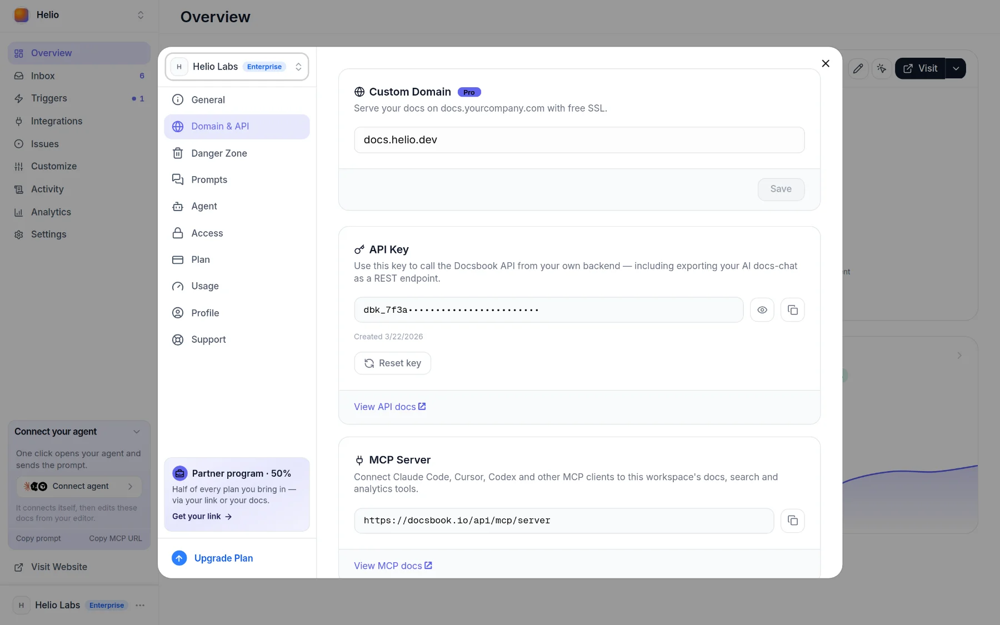

# Migrating from GitBook to Docsbook

Sync your GitBook space to a GitHub repository, point Docsbook at that repository, convert GitBook's `` and `` blocks, and redirect any URL that changed.

GitBook's Git Sync already writes your content to GitHub as Markdown, so most of the move is conversion, not export. GitBook details below are from GitBook's docs as of September 2026.

## How do I move from GitBook to Docsbook?

<!-- widget:stepper -->

### Sync the GitBook space to GitHub

Turn on Git Sync for the space and connect a GitHub repository; Git Sync is on every GitBook plan, Free included. GitBook writes each page as a Markdown file, plus `SUMMARY.md` for the table of contents and, if you use one, a `.gitbook.yaml` config.

### Create the Docsbook project from that repository

[Start on Docsbook](https://docsbook.io/?start=1) and import the repository. Every `.md` file becomes a page, `README.md` is the home page, and the site goes live at `https://<owner>.docsbook.io/<repo>`.

### Convert the GitBook blocks

Docsbook does not read GitBook's template tags, so they would show up as text. Convert them with the table below, or ask the agent to do it for you.

### Check every URL

Compare your old URLs with the new ones. For each path that changed, add a redirect to `.docsbook/redirects.json`, as shown further down.

**On a [custom domain](../site/custom-domain.md)** the redirects file does not fire yet — it works on the site's `docsbook.io` address — so keep the old paths wherever you can.

### Move your domain

In **Settings ▸ Domain & API**, enter your domain, then add one DNS record: a `CNAME` to `cname.vercel-dns.com` for a subdomain, as the [custom domain](../site/custom-domain.md) page shows. A custom domain can be attached once you subscribe or the free trial has ended.



### Switch off Git Sync

When Docsbook serves your domain, turn off Git Sync in GitBook so there is one place to edit.

<!-- /widget -->

## What changes in the Markdown?

The pages move as they are; GitBook-specific syntax and files need a Docsbook equivalent.

| GitBook | Docsbook |
|---|---|
| `` … `` | A [`callout` widget](../site/widgets.md) with `type=info`; `success`, `warning` and `danger` map one to one |
| `` with `` | A `tabs` widget with one `### macOS` heading per tab |
| `SUMMARY.md` | Delete it: the folder tree is the sidebar, and a leftover `SUMMARY.md` would publish as a page |
| `redirects` in `.gitbook.yaml` | Entries in `.docsbook/redirects.json` |

A converted hint looks like this, and the markers stay invisible when the file is read on GitHub:

<!-- widget:code-group -->

#### GitBook

```markdown

Rotate the API key before you deploy.

```

#### Docsbook

```markdown
<!-- widget:callout type=warning -->

Rotate the API key before you deploy.

<!-- /widget -->
```

<!-- /widget -->

## Can the agent do the conversion?

Yes. Tell the Docsbook agent what you want, from Claude Code, Cursor or the panel chat ([Get discovered](../get-discovered.md)):

```text
Convert every GitBook hint and tabs block in this repository to Docsbook callouts and tabs, and delete SUMMARY.md.
```

The work arrives as a [pull request](../agent/review.md); with **Auto-merge** off, it waits for your approval before anything goes live. On a repository in your own GitHub account, install the Docsbook GitHub App with **Contents: Read and write** first, so the agent can open it.

## How do I keep my URLs?

Docsbook serves each file at its own path: on your domain, `guides/setup.md` is `/guides/setup`. Where a path changed, map the old one to the new one in `.docsbook/redirects.json`:

```json
{
  "version": 1,
  "redirects": [
    { "from": "getting-started/setup", "to": "guides/setup" }
  ]
}
```

Both sides are page paths without `.md`, and the file holds up to 500 entries. When the agent moves a page, it adds the redirect itself.

## What do you get after the move?

The site you had, plus the parts that make it findable and keep it current:

- **An [AI chat](../ai-chat/README.md)** that answers readers from your pages and cites them (Pro).
- **[`llms.txt`](../geo/llms-txt.md), a Markdown copy of every page and an MCP server**, generated for you.
- **[Translations](../site/translations.md)** into 15 languages, each page at its own URL (Pro).
- **An agent that finds the next win** — failed searches, unanswered questions, AI answers that cite someone else, on Pro ([Find wins fast](../find-wins-fast.md)).

## FAQ

<!-- widget:accordion -->

### Will I lose search traffic when I leave GitBook?

Not if every old URL keeps working. Keep the same paths where you can, and redirect the rest in `.docsbook/redirects.json`; a URL that starts returning 404 is the one that loses its traffic.

### What about my API reference?

Docsbook hosts an interactive OpenAPI reference that readers can try calls from, and the **OpenAPI sync** trigger (Pro) rebuilds it from your spec every day.

### Does Docsbook read SUMMARY.md?

No. The sidebar comes from your folders and file names, in reading order: `README.md`, introduction and quickstart pages first, reference, changelog and FAQ pages last.

<!-- /widget -->

## Next steps

<!-- widget:cards plain cols=2 arrow=hover -->

- [GitBook vs Docsbook](./gitbook-vs-docsbook.md) — Pricing, AI and editing compared {git-compare}
- [Custom domain](../site/custom-domain.md) — Serve the docs from your own domain {globe}
- [Edit and publish](../site/editing.md) — Editor, GitHub sync, review mode and redirects {git-branch}
- [Find wins fast](../find-wins-fast.md) — What the agent fixes first after you move {zap}

<!-- /widget -->
