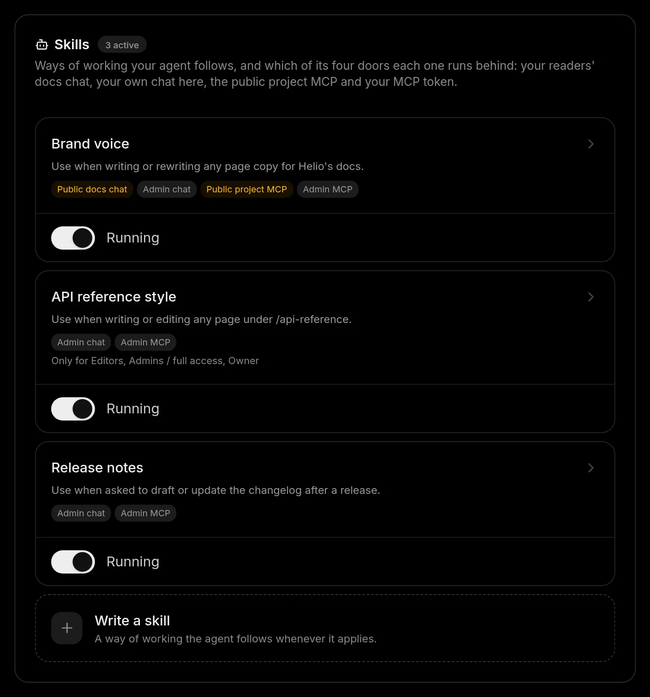

# Skills

A skill is a way of working you write once — the house style for API pages, how to answer a billing question — and the Docsbook agent follows it wherever you place it: your readers' chat, your own chat, or either MCP server.

## Where do skills live?

On the **Skills** card in **Settings ▸ Prompts**. Each skill shows where it runs and who it runs for, with a **Running** / **Paused** switch; **Write a skill** opens the editor.



Skills sit on your organization's shelf, the same one that holds the agent's [memory](./memory.md), so a skill written on one project works for every project of that organization.

## Write a skill

The editor takes over the Settings page; **Back** returns you to the card.

<!-- widget:stepper -->

### Name it

**Name** is what the card shows — for example, "House style for API pages".

### Say when to reach for it

**When should the agent reach for it?** is the trigger, not the job: "when a page about an endpoint has no example request". It is the one field that decides whether the skill is ever used.

### Write the instructions

**Instructions** are the steps, in order, and what never to do — in Markdown.

### Choose where it runs

Tick the doors under **Where does it run?** — see the table below.

### Choose who it runs for

Tick roles under **Who does it run for?**, or particular people under **Or particular people**. Nothing ticked means anybody.

### Save

Press **Create skill**. It starts running at once on the doors you ticked.

<!-- /widget -->

## Where can a skill run?

One agent answers through four doors, and a skill runs only behind the ones you tick:

| Door | What it is | Ticked for a new skill? |
|---|---|---|
| **Public docs chat** | The [AI chat](../ai-chat/README.md) readers open on your published site | No |
| **Admin chat** | Your own chat in the panel | Yes |
| **Public project MCP** | The anonymous [MCP server](./mcp-server.md) your readers' agents connect to | No |
| **Admin MCP** | Your MCP token, and the runs the Docsbook agent makes for you | Yes |

<!-- widget:callout type=warning -->

**Nothing ticked means nowhere**: the skill is saved and never runs. The two public doors change what readers see — the card says so next to them — so a skill reaches readers only when you tick one.

<!-- /widget -->

How a skill arrives depends on the door:

- **In the two chats**, its text goes into the agent's instructions on every turn — up to 8,000 characters of each skill and 24,000 in all. A skill past that total is still named, with its trigger, so the agent knows it exists.
- **On the two MCP servers**, `find_skill` answers with your skills first — name, trigger and where it runs — ahead of Docsbook's public catalog.

## Who does a skill run for?

Roles narrow a skill on any door: **Readers (no account)**, **Viewers**, **Editors**, **Admins / full access** and **Owner**.

**Or particular people** lists everyone with access to the project, including invites not yet accepted. A restriction is met only by evidence:

- **A visitor with no account** counts as a reader, never as "anyone".
- **A skill aimed at named people** runs only where the agent knows the person's email — so never for an anonymous reader, and never over an MCP token.

## Write one with the agent

Ask in the admin chat — "Write a skill: every API page opens with a working request" — and the agent drafts it, saves it and tells you where it runs. New skills go on your two own doors; it asks before putting one on **Public docs chat**.

A good skill is short and specific:

```markdown
Name: House style for API pages
When should the agent reach for it? When it writes or edits a page about an endpoint.

Instructions:
1. Open with one sentence: what the endpoint does and who calls it.
2. Show a working curl request before the parameter table.
3. List every error the endpoint returns, with what the caller should do.
4. Never state a limit or a default the source does not — link where it is stated, or leave it out.
```

## FAQ

**Who can change skills?** Owners and admins — full access to the project. Everyone else who can open it sees which skills are in force, and the agent refuses to save a skill for them.

**How is a skill different from Agent instructions?** **Agent instructions**, on the same tab, are standing rules for your own agent on every turn and every run. A skill is one way of working with a trigger, and you choose its doors — including the ones your readers use.

**Can a skill make the agent say something untrue?** No. Skills rank above the agent's own habits, but not above its honesty rules: a skill cannot authorise inventing a fact, promising a capability or claiming work that was not done.

## Next steps

<!-- widget:cards plain cols=2 arrow=hover -->

- [Agent memory](./memory.md) — The facts the agent keeps next to your skills {brain}
- [AI chat settings](../ai-chat/configure.md) — The reader chat's prompt, questions and model {settings}
- [MCP server for your docs](./mcp-server.md) — Where the Public project MCP door leads {server}
- [A second brain for your product](./README.md) — How skills fit with pages, sources and memory {network}

<!-- /widget -->
