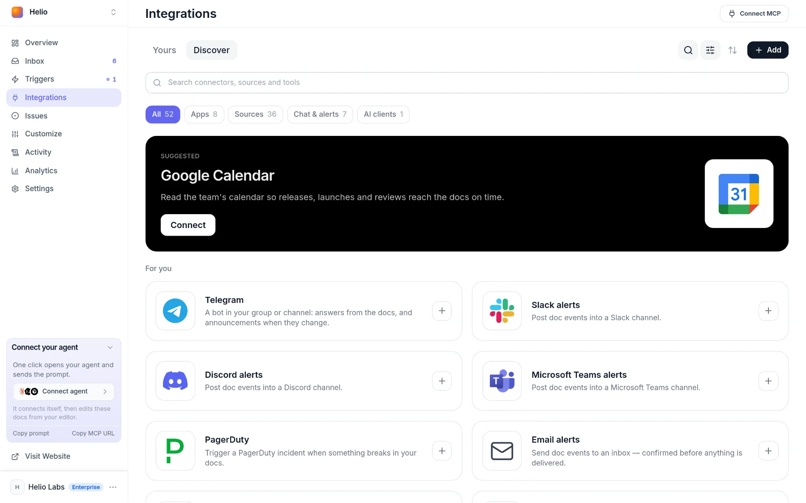

# Sources

A source is an address the Docsbook agent may read — a repository, a website, a spec, a single page — so it writes from what your product actually does and catches pages that stopped being true.

Two sources are there before you add any:

- **Your site's own repository** — the one your docs are built from, listed first and never removable.
- **Your product website** — the address in **Settings ▸ General ▸ Product website**, read for real prices, plans and limits.

## What can be a source?

The address decides the kind, whichever card you paste it into:

| You paste | It becomes | A read returns |
|---|---|---|
| `github.com/acme/api` | Repository | Its readable files, README and docs first; any file by path; the last 10 commits |
| `github.com/acme/api/tree/main/docs` | Repository folder | Only that folder |
| `acme.com` or `acme.com/docs` | Website | Up to 10 pages at a time, found from its `sitemap.xml` |
| `acme.com/pricing.html` | Single page | That one page, read whole |

A file extension in the path makes it a single page. Tracking parameters such as `utm_source` are dropped, so the same page pasted twice is one source.

In **Integrations**, the **Sources** filter lists the named kinds too, each read the same way:

- **Documentation platforms** — Mintlify, GitBook, ReadMe, Docusaurus, Read the Docs, MkDocs, Redocly, Scalar and more.
- **Knowledge bases** — a public Notion page, Zendesk Guide.
- **Code and APIs** — an OpenAPI spec, an npm or PyPI package page.
- **Community** — a Discourse forum's public topics.
- **Files** — upload a PDF, Word file, Markdown or plain text; each becomes a page of your docs.

Cards Docsbook cannot read yet — a Notion workspace, Confluence, GitLab, Slack and others — are drawn muted and say what they would need.

## Connect a source

Connect from the panel, or ask for it from your editor.

<!-- widget:stepper -->

### Open the card

In **Integrations**, open **Discover**, pick the **Sources** filter, and open the card for what you have — **GitHub repository**, **Website**, **OpenAPI spec**, **Mintlify**.

### Paste the addresses

Press **Add addresses** and paste as many as you like, one per line. The dialog shows which card each address will land on before you commit.

### Say why it matters

Fill in **Why this matters, in your words** — for example, "The prices here are the only correct ones." The agent reads it as an instruction, and it applies to every address in the batch.

### Connect

Press the **Connect** button at the foot of the dialog. Each address reports back on its own line, and the card lists it under **Addresses**, marked "not read yet" until the agent reads it.

<!-- /widget -->

From Claude Code, Cursor or Codex, [your MCP connection](../get-discovered.md) does the same with `connect_source`. It proves a repository is readable before storing it, and needs a token authorised with **Allow editing documentation**.

<!-- widget:callout type=warning -->

**Private repository?** Install the Docsbook GitHub App on it first — **Contents: read** is enough. Reads go through that installation, so they also work in scheduled runs with nobody signed in; without it, GitHub answers as if the repository did not exist.

<!-- /widget -->

## What the agent does with a source

Before it writes or judges a page, the agent lists your sources and reads the ones that bear on the task. Your note travels with each source as an instruction.

These [trigger cards](../agent/triggers.md) run on sources by themselves. The ones that wake when your docs "finished re-indexing" need [search by meaning](./README.md#how-fresh-is-the-brain) on, because that re-index is what wakes them.

| Card | Wakes | What it does |
|---|---|---|
| **Find pages the code outgrew** | Your docs changed and finished re-indexing | Reads what changed in the source, fixes what the code plainly contradicts, proposes the rest |
| **MCP sync** | Daily | Compares every tool your MCP server registers with what the docs say about it |
| **OpenAPI sync** | Daily | Rebuilds the API reference from your spec |
| **SDK sync** | Daily | Keeps the reference in step with what your SDK exports |
| **Document the API surface** | Your docs changed and finished re-indexing | Finds endpoints, options and errors that exist in code but nowhere in the docs |
| **Write the release notes** | Your docs changed and finished re-indexing | Turns the commits and merged work of a release into notes |

<!-- widget:callout type=note -->

**OpenAPI sync** ships pointing at a demo spec. Replace that link in the card's prompt with your own spec's address — until you do, it changes nothing and reports that the link needs replacing.

<!-- /widget -->

To wake the agent when code lands rather than when docs change, connect the **GitHub** card in **Integrations** and arm an occasion: **Code landed** and **API spec changed** are checked every 15 minutes, **Release published** hourly. See [Triggers](../agent/triggers.md).

## How much of a source is read?

A read happens when the agent asks for one, against the live address:

- **Repository listing** — up to 300 files, README and docs first; dependency and build folders are left out of the list, but any file can be read by its path.
- **One file or page** — up to 25,000 characters, marked when cut.
- **A website without a path** — up to 10 pages from its sitemap, 8,000 characters each; with no sitemap, only the page you connected.
- **Commits** — the last 10: message, author and date.

## Change or remove a source

Ask the agent, or call `configure_source` from your editor with a read-write token. It renames a source, rewrites its note, pauses it (`enabled: false`) or removes it (`disconnect: true`) along with any GitHub authorisation attached to it. See the [MCP tools reference](../mcp-tools/README.md).

## FAQ

**Does the AI chat on my site read my sources?** No. It answers readers from your published pages; sources are read by the agent, the admin chat and your own MCP client.

**Does Docsbook copy my sources?** No. Nothing is mirrored or crawled on a timer: a source is read when the agent needs it, and website reads respect `robots.txt`.

**Why does a website read return only one page?** Its section is not in the site's `sitemap.xml`, or there is no sitemap. Ask for a specific path, or connect the repository behind the site instead.

## Next steps

<!-- widget:cards plain cols=2 arrow=hover -->

- [Triggers](../agent/triggers.md) — The ready-made cards that read your sources on a schedule or an event {zap}
- [Agent memory](./memory.md) — Where the agent keeps what a source taught it {brain}
- [Skills](./skills.md) — Tell the agent how to write from a source {sparkles}
- [A second brain for your product](./README.md) — How sources fit with pages, memory and skills {network}

<!-- /widget -->
