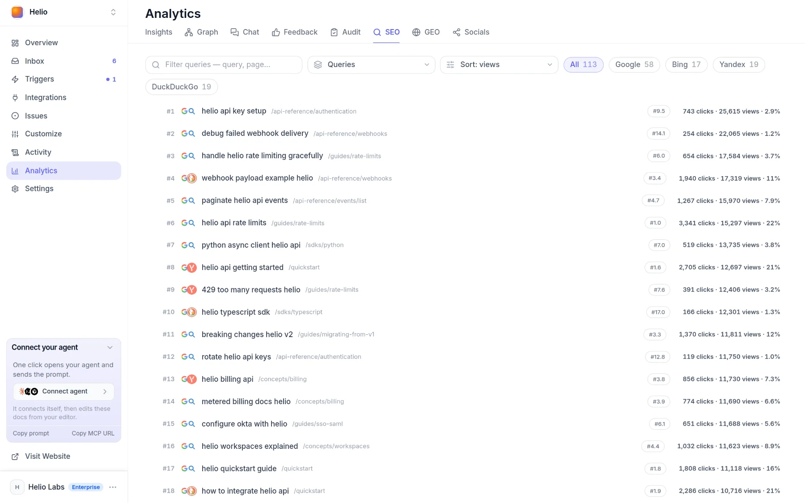
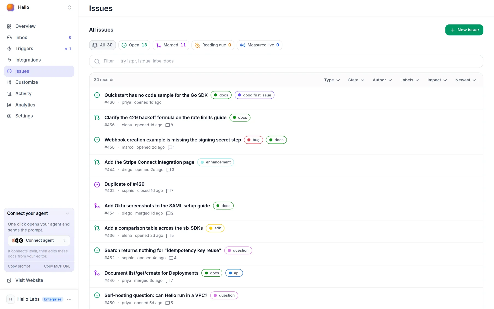
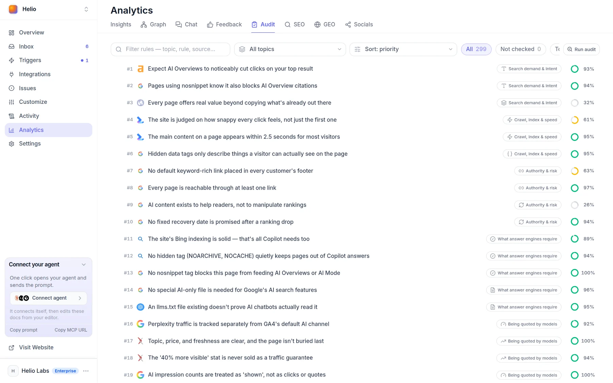

# Find wins fast

Docsbook's agents read every signal your docs give off, weigh it against 299 published rules, and make the change most likely to move a number first — each with a reason, a prediction and a date to check it.

## Where do wins come from?

A win starts with a signal somebody left behind: a reader, a search engine or an AI assistant. The [Docsbook agent](./agent/README.md) reads all of them, and most are open to you in the panel.

| Signal | What it tells the agent | Where you see it |
|---|---|---|
| **Search queries and CTR** | Which queries show a page, and its clicks, click-through rate and position | **Analytics ▸ SEO**, views Queries and Pages |
| **AI crawls and answers** | Which assistants fetched a page to answer someone, which crawlers index or train on it, which questions name you | **Analytics ▸ GEO**, views Crawlers and Prompt mentions |
| **Unanswered chat questions** | What readers asked the [AI chat](./ai-chat/README.md) that it could not answer | **Activity ▸ Chat ▸ Content gaps**; dead-end conversations on **Analytics ▸ Chat** |
| **Thumbs-down** | Pages and chat answers readers rated down | **Analytics ▸ Feedback**, chip Dislikes |
| **Searches with no results** | Words readers typed into your docs search that found nothing | **Activity ▸ Chat ▸ Content gaps**; a [trigger](./agent/triggers.md) can wake the agent when one happens |
| **Dead ends and traffic drops** | Pages readers leave without going anywhere, and pages losing visits | **Analytics ▸ Insights**, the Exit tab and visits over time |
| **Competitors** | Who search results and answer engines name for your questions instead of you | **Analytics ▸ SEO** and **Analytics ▸ GEO**, view Competitors |



Outside your docs, the agent also reads Google's and Bing's live results — including the AI Overview and the sources it cites — keyword demand, and the Reddit, Hacker News and Stack Overflow threads where your readers ask instead of you.

## How does the agent pick what to fix first?

It matches each signal to the rule it breaks in the [expertise catalog](./agent/expertise.md), and three gates decide which rules can become work:

1. **Established rules only.** 244 of the 299 rules rest on a vendor's own documentation, a standard or research. The 42 hypotheses and 13 contested rules stay readable and never become tasks.
2. **Broken on your pages.** The rule's verdict is To do, and the verdict cites a reading taken off your own pages.
3. **Priority 1 or 2.** Priority weighs how much a rule moves the outcome by how often real docs get it wrong. 117 established rules sit at 1 or 2.

What passes is ranked by priority, then by the lowest share of pages that pass, then by how many pages the fix touches. Work the agent does not finish in the run is filed as a GitHub issue that can carry the same kind of prediction — the metric, today's figure, the target and the date to check it — and it shows up in **Issues**.



### What is each fix worth?

A number appears next to a fix only when something measured it:

- **Clicks** — for titles and snippets, search intent and the first screen. A range from your own [Search Console](./seo/search-console.md) data over 28 days, for pages with at least 30 impressions: a page earning less than your pages at the same position is expected to recover 25–50% of that gap.
- **Reach** — for every other rule: the search impressions the change touches.
- **Nothing** — when there is no data. A missing number is never shown as zero.

A forecast carries an amber dot while it is a reasoned estimate. Once five of your own measured changes stand behind it, it is recalibrated to your site and the dot turns green.

<!-- widget:callout type=info -->

The click range is arithmetic over your Search Console rows. The model never supplies the figure, so it cannot talk a fix into looking bigger than it is.

<!-- /widget -->

Ask the chat in your panel how your docs measure up, and the outstanding rules come back as a list you tick — each row with its published source, and a number where one was measured. What you tick is what the agent does next.

## What does a fast win look like?

Six examples of the loop. They show the shape of the work, not results anyone measured.

| Signal | Why it is worth doing | The change | What is measured |
|---|---|---|---|
| A page gets impressions but few clicks | **Titles & snippets**: Google rewrites a title that is half-empty, stale, inaccurate or reused | A distinct, accurate title and description | Search clicks to the page, with a click forecast up front |
| The same search keeps finding nothing | **Write the pages readers wanted**: a query that keeps failing is a missing page | Write the page, or rename the existing one to the words readers typed | Whether the query stops failing |
| The chat cannot answer a question | **Passages**: an answer engine lifts one section, not the whole page | A section that answers that one question and names its subject | Whether the question stops going unanswered |
| A page collects thumbs-down | **Fix what readers rated down**: find what the page failed to say | The missing step or answer, moved to the top | Whether the page's rating recovers |
| An answer engine names a competitor for your core question | **Content moves**: topic, price and freshness decide whether a page gets cited at all | The topic, price and update date stated plainly | Watched questions whose answer names the page |
| A page nothing links to | **Links**: an unlinked page is invisible to Google | A link from the navigation and from related pages | Views of the page |

## How is a win proved on the date?

The prediction is written down before the change merges, and code — not the model — decides whether it came true.

<!-- widget:stepper -->

### The pull request states the bet

A change arrives as a [pull request](./agent/review.md) that can carry expectations: the page, the rule it applies, the instrument that measures it, today's reading, the target and the day to look. They sit in a visible `docsbook-expect` block, so the claim is readable on GitHub too.

### A bet too small to judge is refused

The target has to move in the direction the instrument counts as better, and by at least 10% — anything smaller is ordinary week-to-week noise. A pull request carries at most 20 expectations.

### Merging records the rule as applied

When the pull request merges, each rule is recorded as applied to its page, with the pull request as the evidence. It counts toward that rule's coverage on **Analytics ▸ Audit**.



### On the date, the same reading is taken again

The agent reads the same instrument a second time. Code compares the two recorded readings and returns As predicted, No effect, Went backwards or Cannot tell, with the share of the predicted move that happened.

### The verdict stays on the record

The verdict stays on the pull request in **Issues**, a miss included. For changes to titles and snippets, search intent and the first screen, measured results calibrate the next click forecast.

<!-- /widget -->

A docs commit can also be measured on its own: the agent compares the pages it touched with the pages it did not, the week before and the week after, so a site-wide swing is not mistaken for the change's effect.

## The loop, end to end

<!-- widget:journey cols=2 -->

### Signal

A query losing clicks, a question the chat could not answer, a page rated down.

- [Search engines see you](./seo/README.md) {search}
- [AI engines read and cite you](./geo/README.md) {globe}
- [You hear every reader](./analytics/README.md) {thumbs-down}

### Rule

The signal is matched to the rule it breaks, one of 299, each with a published source.

- [Expertise: 299 rules](./agent/expertise.md) {clipboard-check}
- [How the agent works](./agent/README.md) {bot}

### Change

A pull request with the page, the rule and the number it should move.

- [Review and publish](./agent/review.md) {git-pull-request}
- [Triggers that start the loop](./agent/triggers.md) {zap}

### Measure

On the check date the reading is taken again, and code computes the verdict.

- [Docs analytics](./analytics/insights.md) {chart-line}
- [Goals and funnels](./analytics/goals.md) {target}

<!-- /widget -->

## Tell your agent

Say the goal, and the agent decides the steps:

```text
Find the three changes most likely to grow our search clicks this month, and make the first one.
Our quickstart keeps getting thumbs-down. Work out what it fails to say and fix it.
Which questions did the chat fail on this week? Write what was missing.
Where do AI answers name a competitor instead of us? Fix what is ours to fix.
Which merged changes are due for a check? Take the readings.
```

Send it from Claude Code, Cursor or Codex once you have [connected Docsbook](./get-discovered.md), or type it into the chat in your panel.

## FAQ

<!-- widget:accordion -->

### Does the agent guess how much a fix is worth?

No. A click forecast is computed from your own Search Console rows and appears only for titles and snippets, search intent and the first screen. Other rules get their reach in impressions, or no number at all.

### What happens when a prediction misses?

The verdict says so — No effect or Went backwards — on the pull request in [Issues](./agent/review.md), next to the readings it came from. For the three click axes, measured results replace the reasoned forecast once five changes have been measured.

### Do I need Google Search Console?

You don't connect one: Docsbook reads Search Console itself for sites at `<owner>.docsbook.io/<repo>`, and click forecasts and reach come from that data ([Search data](./seo/search-console.md)). Chat, feedback, AI crawler and page-view signals come from Docsbook's own analytics and work without it.

### Why are hypotheses never turned into work?

A hypothesis is a rule practitioners repeat with no vendor documentation, standard or research behind it. The agent can still read it and tell you about it, but a task list that mixed it with established rules would give a webinar claim the weight of Google's own documentation.

<!-- /widget -->

## Next steps

<!-- widget:cards plain cols=2 arrow=hover -->

- [How the agent works](./agent/README.md) — One worker that reads, writes, configures and measures {bot}
- [Expertise: 299 rules](./agent/expertise.md) — What the agent checks, axis by axis {clipboard-check}
- [Triggers](./agent/triggers.md) — 50 ready-made workflows that run the loop on their own {zap}
- [Tell your agent](./get-discovered.md) — Connect Docsbook to your editor in one line {plug}

<!-- /widget -->
