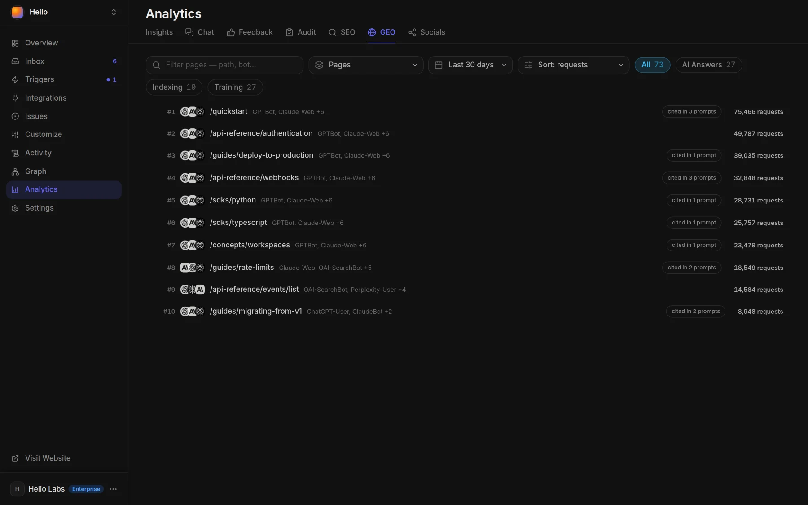
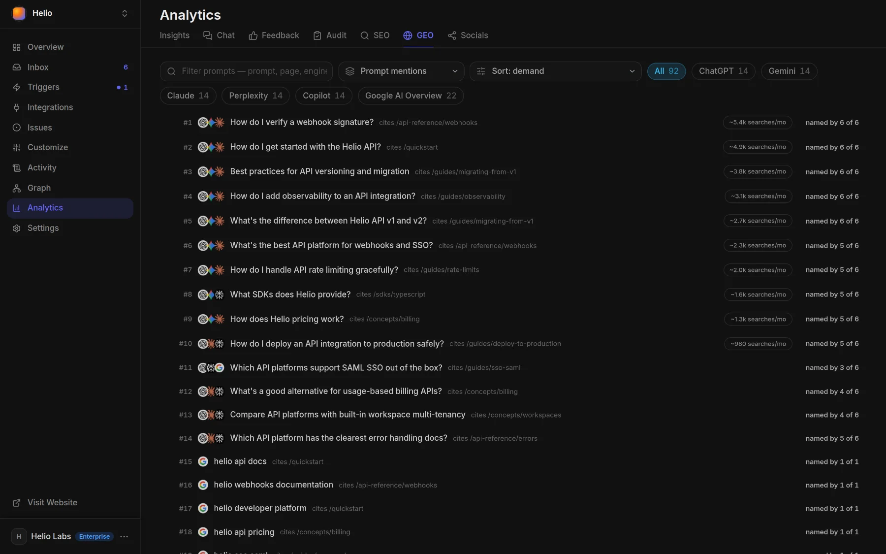

# Track AI citations of your docs

Docsbook measures AI visibility three ways: which AI crawlers read each page and why, which readers arrive from an AI assistant, and whether answer engines name you for the questions you watch.

## Which AI crawlers read your docs?

**Analytics ▸ GEO ▸ Pages** and **▸ Crawlers** show the page views Docsbook records from AI crawlers over the period you pick. Each crawler is filed under the reason it came, because the three mean different things:

| Chip | What it means | Crawlers counted there |
|---|---|---|
| **AI Answers** | An assistant fetched the page while answering someone, right then | `ChatGPT-User`, `Perplexity-User`, `Claude-Web`, `DuckAssistBot`, `MistralAI-User` |
| **Indexing** | A crawler is building the index an answer engine retrieves from later | `OAI-SearchBot`, `PerplexityBot`, `Bingbot`, `Applebot`, `YouBot` |
| **Training** | Text collected to train models; nothing is cited back | `GPTBot`, `ClaudeBot`, `CCBot`, `Applebot-Extended` and others |



The **Pages** view shows, per page, the requests, the crawlers and how many checked questions cite it. The **Crawlers** view shows each crawler with its company, requests, distinct visitors, and how often that company's engine named you in checked questions.

## Which readers came from an AI assistant?

**Analytics ▸ [Insights](../analytics/insights.md)** files a visit under **AI assistant** when an assistant sent it. That covers two cases:

- **A link in an answer** — the visit's referrer is `chatgpt.com`, `perplexity.ai`, `claude.ai`, `gemini.google.com` or `copilot.microsoft.com`
- **A fetch for a user** — an assistant opened the page on someone's behalf, as `ChatGPT-User`, `Perplexity-User` or `Claude-User`

## Do answer engines name you?

Choose up to 5 questions per engine and Docsbook checks them every day, including questions you don't rank for yet. Ask the agent to watch them, or call [`configure_mentions`](../mcp-tools/settings/configure-mentions.md).

| Engine | What each daily check records |
|---|---|
| **Google AI Overview** (`ai_overview`) | Whether Google's AI answer names your docs, and whether it cites them or only ranks them below |
| **Google** (`google`) | Your position on the results page, and which other sites there talk about your product |
| **Bing** (`bing`) | The same on Bing, the index Copilot draws on, where a site that wins on Google can be missing |

AI Overview results land in **Analytics ▸ GEO ▸ Prompt mentions**; Google and Bing in **Analytics ▸ SEO ▸ Google & Bing mentions**. Every question keeps its earlier readings, so each change has a before and an after.



Docsbook does not put questions to ChatGPT, Claude or Perplexity itself. Checks you run there can be recorded with your project API key from **Settings ▸ Domain & API**, and they appear in **Prompt mentions** beside Google's:

```bash
curl -X POST https://docsbook.io/api/v1/mention-checks \
  -H "Authorization: Bearer <your-api-key>" \
  -H "Content-Type: application/json" \
  -d '{"engine": "perplexity", "date": "2026-09-20", "query": "best tool to host API docs", "mentioned": true, "page": "/quickstart"}'
```

Send one check per call, or up to 200 as `{"checks": [...]}`.

| Field | Value |
|---|---|
| `engine` | The engine you asked, such as `chatgpt`, `claude` or `perplexity` |
| `date` | The day of the check, as `YYYY-MM-DD` |
| `query` | The question you asked |
| `mentioned` | Whether the answer named your docs |
| `page` | The page the answer cited (optional) |

## Who gets named instead of you?

**Competitors** lists the sites engines name or rank for your questions, and **Competitor prompts** shows each question with whether you were named too. **Competitor tactics** shows which [expertise catalog](../agent/expertise.md) rules the pages that win those questions apply.

## What does the agent do with these numbers?

The [Docsbook agent](../agent/README.md) reads these numbers on the weekly **Do AI engines cite you** and **Where competitors get named** [triggers](../agent/triggers.md), and whenever you ask. The gaps it works from:

- **Read but never cited** — pages AI crawlers read often that no checked question cites, examined for what makes them unquotable
- **Crawled but not named** — a company whose crawlers read you while its engine rarely names you
- **Named instead of you** — questions where an engine cites a competitor, answered with the page you are missing
- **Its own bets** — a change predicts how many watched questions will name the page, and Docsbook computes the verdict on the check date

## What can these numbers not tell you?

Read every AI visibility number with these limits in mind; most come from the catalog's Measurement rules:

- **A crawl is not a citation** — only an **AI Answers** fetch happens while someone is being answered
- **Crawler counts are a floor** — page views are recorded by a script in the page, so a crawler that reads the HTML without running JavaScript leaves no trace, and pages on a custom domain are not counted yet
- **A user agent can be faked** — crawlers are recognised by the name they send; the catalog's rule is to confirm them against the vendor's published IP ranges, which these counts do not do
- **Search Console's AI report counts impressions only** — it has no clicks, queries, CTR or position
- **GA4's AI Assistant channel is a fixed list** — ChatGPT, Gemini, Deepseek, Copilot and Grok; Perplexity is not on it, and AI Overviews visits count as Organic Search
- **Referral counts are a floor** — many visits influenced by an AI answer arrive with no referrer at all
- **Only watched questions are checked** — a question nobody added is never asked

## FAQ

<!-- widget:accordion -->

### Can Docsbook tell me whether ChatGPT cites my docs?

Partly. It sees `ChatGPT-User` fetching your pages while answering someone, and readers arriving from `chatgpt.com`; it does not ask ChatGPT itself. For Google's AI Overview it checks the questions you watch every day.

### Why is a page read a lot but never cited?

Look at who reads it first. **Training** crawlers never cite back, and **Indexing** crawlers only make a page available to answers later; only **AI Answers** fetches mean it was used in an answer.

<!-- /widget -->

## Next steps

<!-- widget:cards plain cols=2 arrow=hover -->

- [AI engines read and cite you](./README.md) — What Docsbook does for GEO, and the agent's loops {sparkles}
- [Search data](../seo/search-console.md) — The Google side: queries, clicks and positions {chart-line}

<!-- /widget -->
