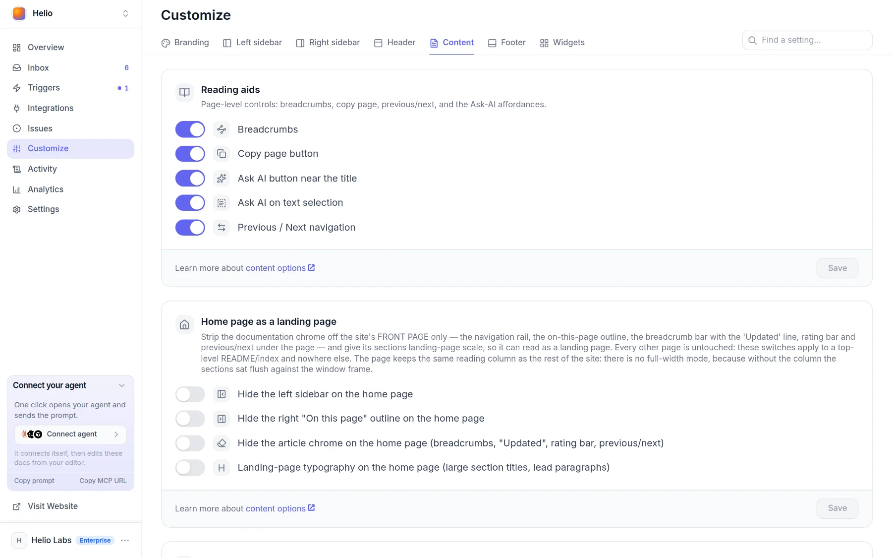

# llms.txt and Markdown for AI agents

Docsbook generates `llms.txt`, `llms-full.txt` and a Markdown copy of every page for you, so an AI agent can read your docs as plain text instead of parsing HTML.

## Where are the files?

Both index files sit at the root of your site's `docsbook.io` address, and there is nothing to build or commit.

| Your site | `llms.txt` and `llms-full.txt` |
|---|---|
| Hosted by Docsbook, or with an address set in **Settings ▸ General ▸ Site source** | `https://<name>.docsbook.io/llms.txt` and `/llms-full.txt` |
| Built from your GitHub repository | `https://<owner>.docsbook.io/llms.txt` and `/llms-full.txt`, covering every site of that owner |
| On a [custom domain](../site/custom-domain.md) | Not served on the custom domain yet |

Both are built from your published pages; `llms.txt` is cached for an hour and `llms-full.txt` for a day. To see real ones, open Docsbook's own at `https://docsbook.io/docs/llms.txt` and `https://docsbook.io/docs/llms-full.txt`.

## What's inside llms.txt?

An index in the [llmstxt.org](https://llmstxt.org/) shape: a `#` title, a one-line summary, and one link per page with its Markdown address beside it. Under the title, it reads like this:

```markdown
> Documentation for acme, hosted on Docsbook. This file lists every public documentation page available on https://acme.docsbook.io so AI assistants can discover and link to it.

## Acme Docs

- [Overview](https://acme.docsbook.io/docs): markdown https://acme.docsbook.io/api/md/acme/docs/README
- [Quick Start](https://acme.docsbook.io/docs/quick-start): markdown https://acme.docsbook.io/api/md/acme/docs/quick-start

## Translations

- Acme Docs is published in: German (de).
  Any page above is available in a language by inserting its ISO code into the path — for example https://acme.docsbook.io/docs/quick-start → https://acme.docsbook.io/de/docs/quick-start.
```

A few things to know about the file:

- **The title** — your site's name for a single site, your GitHub login (`# acme`) for an owner-wide file
- **Link text** — built from the file name: `api-rate-limits.md` is listed as "Api Rate Limits", and `README.md` as "Overview"
- **Two addresses per page** — the page itself, so a citation leads readers to your docs, and its Markdown copy for the agent
- **Languages** — a **Translations** section names every published language and shows the URL pattern
- **The last section** — the Docsbook MCP server and skills catalog, for agents that manage docs

## What's inside llms-full.txt?

The full Markdown of every page in one file, frontmatter removed. Each page starts with its title and a `Source:` line holding its URL, so an assistant can cite the page a sentence came from.

The file stops at 1,000 pages or 3 MB of text, whichever comes first. A truncated file says so in its first lines and points to `llms.txt` for the complete list.

## How do I get one page as Markdown?

Every page has a plain-text copy at `/api/md/<owner>/<repo>/<page path>`. Copy the exact address from `llms.txt`, where it sits next to each page:

```bash
curl https://docsbook.io/api/md/docsbook-io/docs/CHANGELOG
```

The response is the page's Markdown file, frontmatter included, cached for up to a day. Leave out the page path to get every page of the repository in one response.

<!-- widget:callout type=note -->

Adding `.md` to a page's URL does not return Markdown: it redirects to the page itself. Use the `/api/md/` address.

<!-- /widget -->

## Which page buttons hand a page to AI tools?

The **Copy page** button sits at the top of each page, and its menu holds the rest. All items are on by default; switch each one in **Customize ▸ Content**, or ask your agent to call [`update_ui_settings`](../mcp-tools/settings/update-ui-settings.md).

| Item | What it does |
|---|---|
| **Copy page** | Copies the page as Markdown, ready to paste into any assistant |
| **Copy `Skills.md` URL** | Copies the address of the page's Markdown copy |
| **View as Markdown** | Opens the Markdown copy in a new tab |
| **Open in ChatGPT**, **Open in Claude** | Starts a new chat asked to read this page and answer questions about it |
| **Open in Cursor**, **Open in Windsurf** | Opens the page in that editor |
| **Connect MCP** | Copies a prompt that installs this site's public [MCP server](../brain/mcp-server.md) in any agent, with no token |
| **Connect to VSCode** | Installs the same MCP server in VS Code |

The **Copy page button** switch lives on the **Reading aids** card; the other items are on the **Copy page menu** card.



## What does the agent check?

The `llms.txt` axis of the [expertise catalog](../agent/expertise.md) is judged on your own files:

- **Markdown addresses** — the entries in your `llms.txt` name a Markdown copy, not only HTML pages
- **Not blocked** — no `Disallow` rule in your `robots.txt` sweeps up `/llms.txt`
- **Present** — the citability check fetches `/llms.txt`, `/llms-full.txt` and `/sitemap.xml` on every run

The same catalog keeps the claims honest: `llms.txt` is an open proposal rather than a standard, Google says its AI features need no AI text file, and OpenAI, Anthropic and Perplexity do not document their crawlers reading yours. The agent treats the file as free housekeeping, not as a reason for engines to cite you.

## FAQ

<!-- widget:accordion -->

### Can I edit llms.txt?

No. It is rebuilt from your published pages, so you change it by changing the pages: rename a file to change its link text, or switch off **Settings ▸ Access ▸ AI engines** to leave the file entirely.

### Does switching off AI engines hide the Markdown copies?

No. It removes the project from `llms.txt` and `llms-full.txt` and refuses the named AI crawlers in `robots.txt`; the `/api/md/` addresses stay readable, like the pages themselves.

<!-- /widget -->

## Next steps

<!-- widget:cards plain cols=2 arrow=hover -->

- [AI engines read and cite you](./README.md) — Everything Docsbook does for GEO, and the agent's loops {sparkles}
- [Track AI citations](./ai-visibility.md) — See which AI crawlers read which pages {radar}

<!-- /widget -->
