# Creating a Documentation Site

This guide walks you through setting up your first documentation site on Docsbook — no coding experience required. Each step includes screenshots so you always know exactly where to click.

## What You'll Need

Before starting, make sure you have:

- **A computer with internet access** — any OS works (Windows, Mac, Linux)
- **A free GitHub account** — this is where your documentation files will live

If you don't have a GitHub account yet, go to [github.com](https://github.com) and click **Sign up** — it's free and takes about two minutes.

> **What is GitHub?** GitHub is a popular website where people store and share files — especially for documentation and software projects. Think of it like Google Drive, but specifically designed for text files and code. Docsbook reads your files from GitHub and turns them into a beautiful documentation website.

---

## Step 1 — Create a GitHub Account (skip if you already have one)

1. Go to [github.com](https://github.com)
2. Click **Sign up** in the top-right corner
3. Enter your email address and choose a password
4. Choose a username — this will appear in your docs URL (e.g. `docsbook.io/your-username/your-repo`)
5. Verify your email address

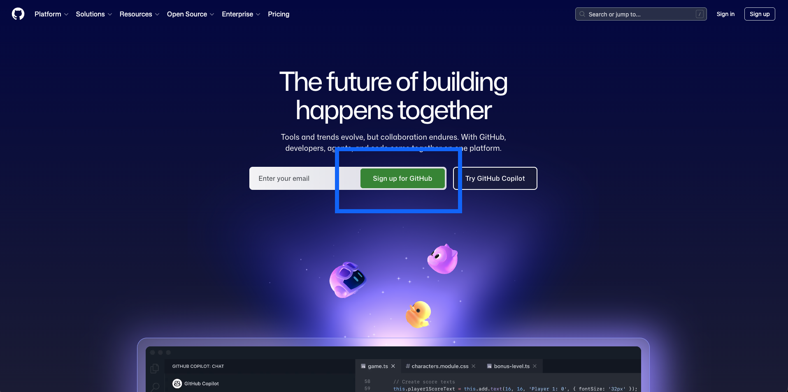

---

## Step 2 — Create a Repository for Your Documentation

> **What is a repository?** A repository (or "repo") is like a folder on GitHub. It stores all your documentation files. You'll need one repository per documentation site.

### Option A — Start with an Example (Recommended for beginners)

The easiest way to get started is to copy one of our ready-made example repositories. This is called **forking** — it creates your own personal copy of the repository that you can freely edit.

1. Go to [github.com/docsbook-io/docs](https://github.com/docsbook-io/docs)
2. You'll see a page with files and a description

   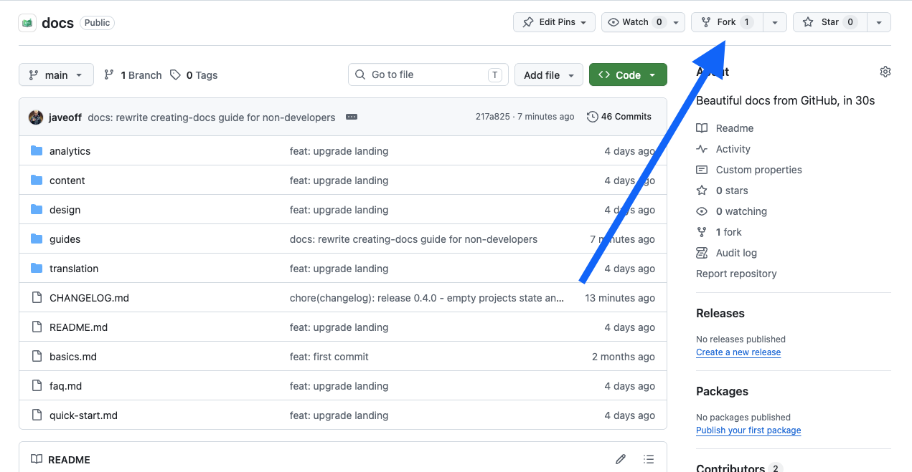

3. Click the **Fork** button in the top-right corner of the page

   > **What does Fork mean?** "Forking" means making your own personal copy of someone else's repository. It's like pressing "Duplicate" on a Google Doc. Your copy is completely independent — changes you make won't affect the original.

4. A dialog appears. Leave all settings as they are and click **Create fork**

   

5. After a moment, GitHub takes you to your new repository at `github.com/YOUR-USERNAME/docs`

   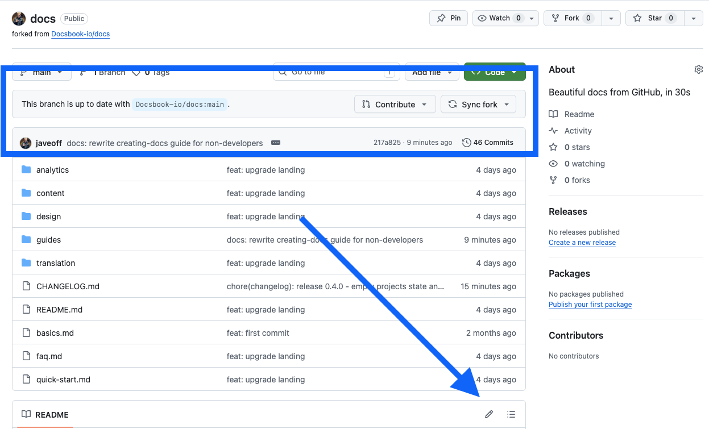

**Done!** You now have a repository with example documentation files ready to edit.

---

### Option B — Start from Scratch

If you prefer to begin with a blank slate:

1. Make sure you're signed in to GitHub
2. Go to [github.com/new](https://github.com/new)

   

3. Fill in the form:
   - **Repository name** — choose a short name with no spaces, e.g. `my-docs` or `product-docs`
   - **Description** — optional, a brief description of what this is
   - **Visibility** — select **Public** (Docsbook requires public repositories)
   - Check **Add a README file** — this creates your homepage

4. Click **Create repository**

   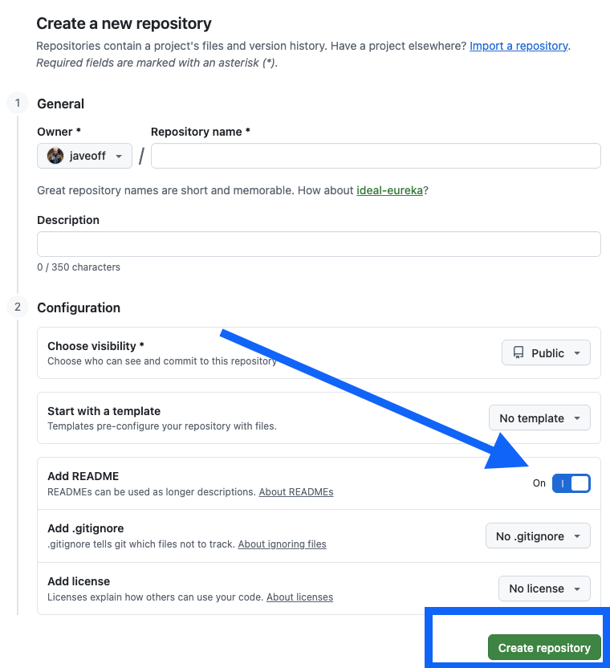

5. Your new repository opens. It contains one file: `README.md`

---

## Step 3 — Connect Your Repository to Docsbook

Now that you have a GitHub repository, let's connect it to Docsbook to create your documentation site.

1. Go to [docsbook.io/connect](https://docsbook.io/connect)

   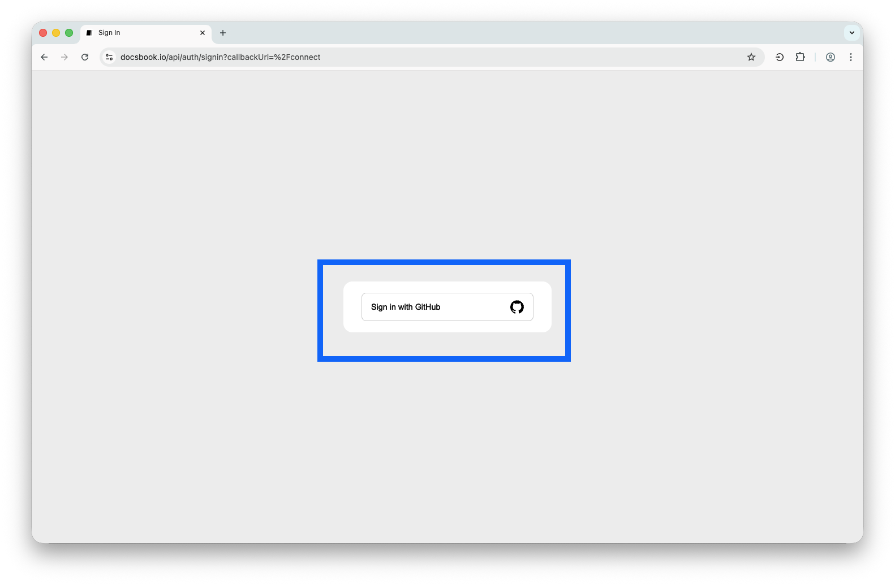

2. Click **Sign in with GitHub**

3. GitHub asks you to authorize Docsbook. Click **Authorize docsbook**

   > Docsbook only reads your repository files — it cannot modify or delete anything.

   

4. You'll see a list of your repositories. Find the one you just created and click on it

   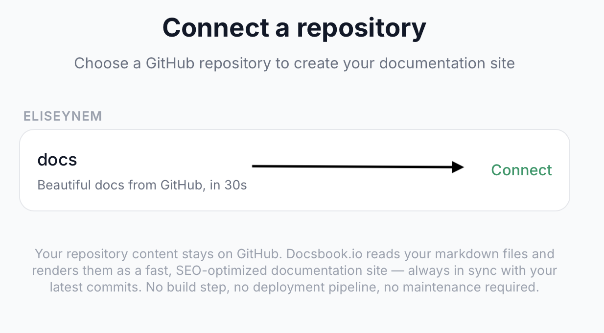

5. Docsbook creates your documentation site. You'll be redirected to it automatically.

Your documentation site is now live at:
```
docsbook.io/YOUR-GITHUB-USERNAME/YOUR-REPO-NAME
```

---

## Step 4 — Edit Your Documentation

There are three ways to edit your documentation files. Choose the one that feels most comfortable.

---

### Option A — Edit Directly on GitHub (Easiest, no setup needed)

This is the simplest method. You edit files right in your browser on GitHub — no software to install.

#### Edit an existing page

1. Go to your repository on GitHub (e.g. `github.com/YOUR-USERNAME/docs`)
2. Click on the file you want to edit, for example `README.md`

   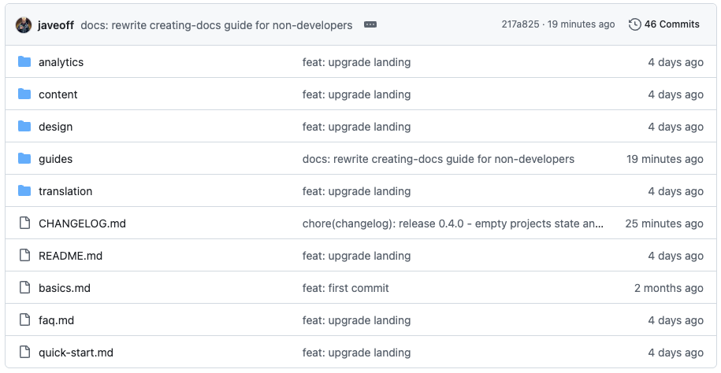

3. Click the **pencil icon** (✏️) near the top-right of the file content

   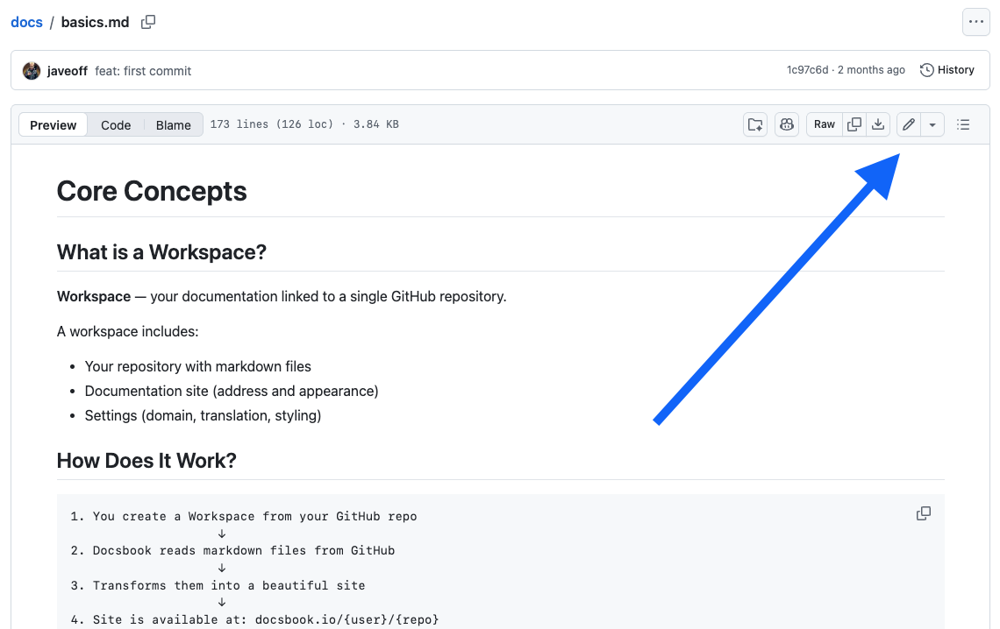

4. The file opens in an editor. Make your changes.

   > Your documentation uses **Markdown** — a simple way to format text. For example: `**bold**` becomes **bold**, `# Heading` becomes a large heading. See the [Markdown guide](#markdown-basics) below for more.

   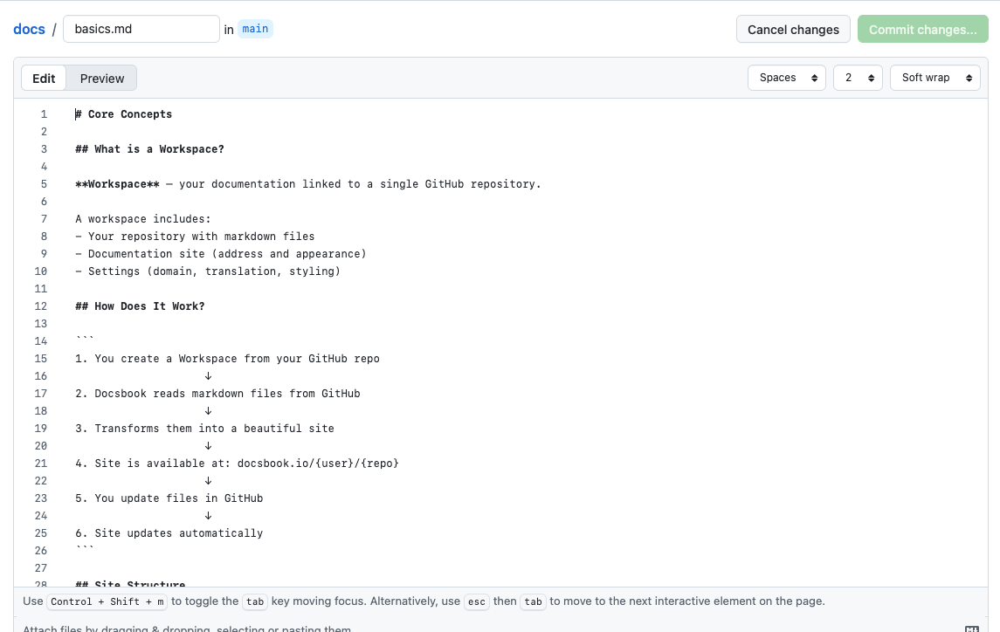

4.1 Learn [how to edit Markdown](https://www.markdownguide.org/) files with pretty customization

5. When you're done editing, scroll down to the **Commit changes** section
6. Optionally, write a short note describing what you changed (e.g. "Update introduction")
7. Click **Commit changes**

   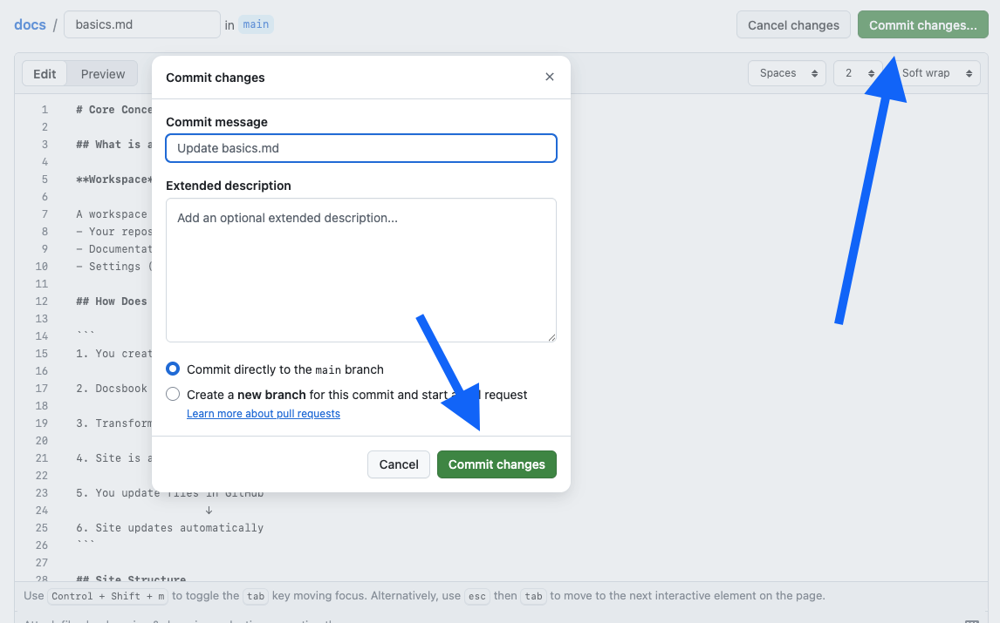

8. Go back to your Docsbook site and refresh — your changes appear immediately.

---

#### Add a new page

1. Go to your repository on GitHub
2. Click **Add file** → **Create new file**

   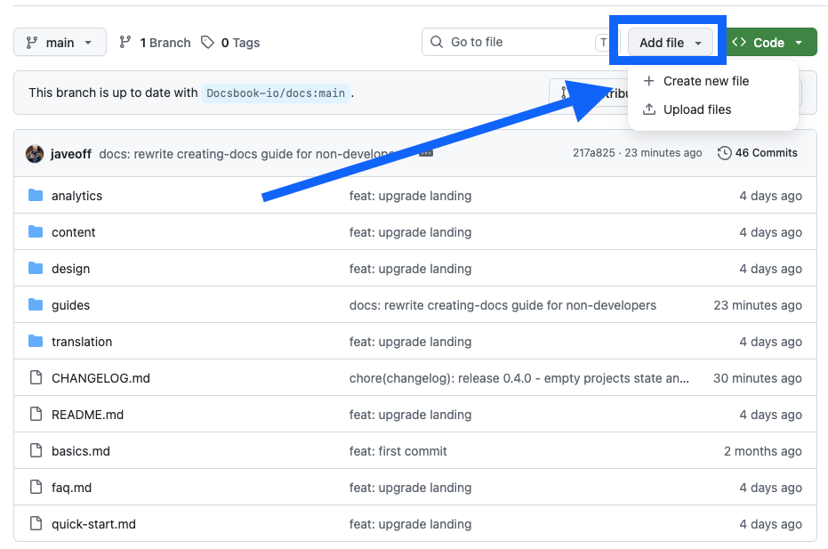

3. In the **Name your file** field, type the path and filename. For example: `guides/installation.md`

   > Typing a `/` in the name automatically creates a folder. For example, `guides/installation.md` creates a `guides` folder with `installation.md` inside.

   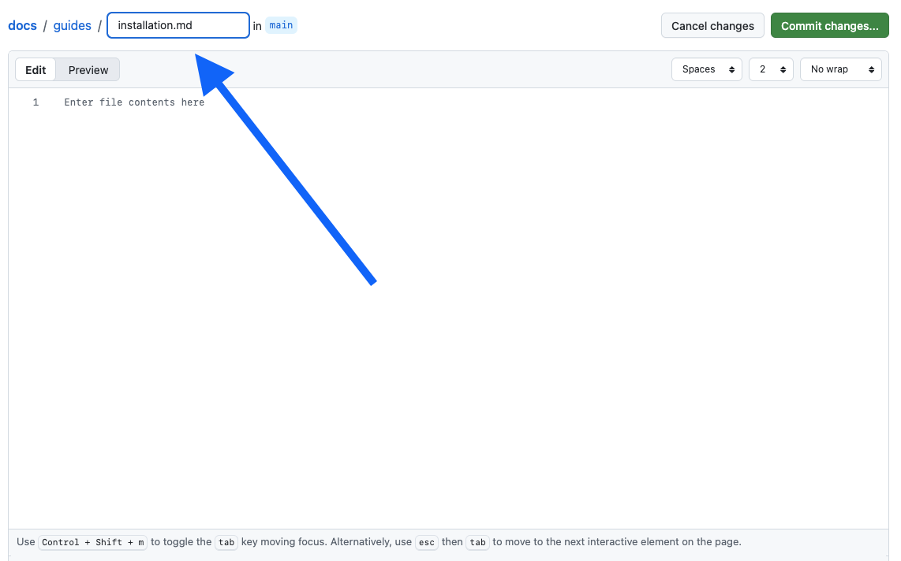

4. Write your content in the editor below
5. Click **Commit new file**

   

The new page appears in your Docsbook sidebar automatically.

---

#### Delete a page

1. Open the file in your repository
2. Click the **⋯ (three dots)** menu icon near the top-right

   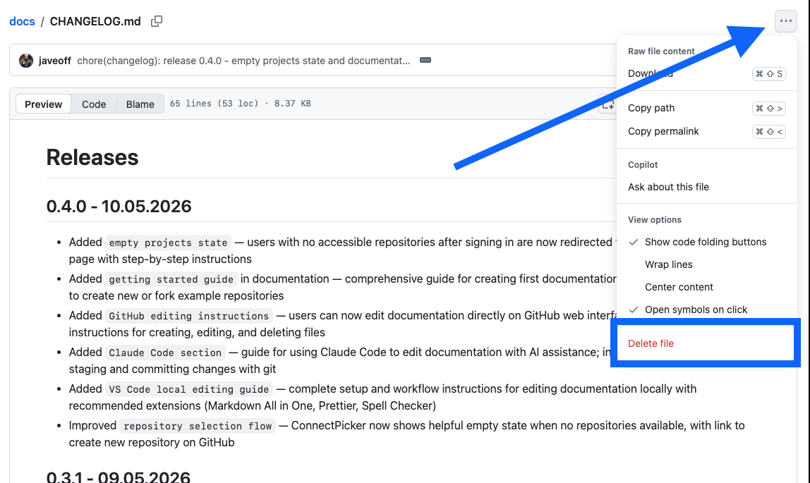

3. Click **Delete file**
4. Click **Commit changes** to confirm

---

### Option B — Edit with Claude Code (AI-assisted, fast)

Claude Code is an AI coding assistant that can write and improve documentation for you. Great if you want to produce a lot of content quickly.

#### Setup (one time)

1. Go to [claude.ai/code](https://claude.ai/code) and download Claude Code
2. Install it following the on-screen instructions

   

3. Open your terminal (on Mac: press `⌘ Space`, type "Terminal", press Enter)
4. Clone your repository to your computer by typing:

   ```
   git clone https://github.com/YOUR-USERNAME/YOUR-REPO-NAME.git
   ```

   Then press Enter.

5. Open the downloaded folder in Claude Code

   

#### Writing documentation with AI

1. Click on any `.md` file in the sidebar to open it
2. In the chat panel, describe what you want — for example:
   - *"Write a getting started guide for our product, 3 paragraphs"*
   - *"Add a section explaining how billing works"*
   - *"Make this paragraph simpler and shorter"*
3. Claude writes the content for you. Review it and make any adjustments.

   

#### Save and publish your changes

After editing, you need to push your changes back to GitHub:

1. In Claude Code's terminal panel (or your terminal), type these commands one by one:

   ```
   git add .
   git commit -m "Update documentation"
   git push
   ```

2. Press Enter after each line.

   

Your Docsbook site updates automatically within seconds.

---

### Option C — Edit with VS Code (Full control, local editing)

VS Code is a free text editor that's popular for working with files on your computer. Best choice if you prefer offline editing or work with documentation regularly.

#### Setup (one time)

1. Download and install [VS Code](https://code.visualstudio.com/) — it's free

   

2. Download and install [Git](https://git-scm.com/downloads)

   > **What is Git?** Git is a tool that keeps track of changes to your files and lets you upload them to GitHub. It's what makes the "commit" and "push" steps work.

3. Open your terminal:
   - **Mac**: press `⌘ Space`, type "Terminal", press Enter
   - **Windows**: press the Windows key, type "Command Prompt", press Enter

4. Type the following command to download your repository to your computer:

   ```
   git clone https://github.com/YOUR-USERNAME/YOUR-REPO-NAME.git
   ```

   Press Enter. A new folder is created on your computer with all your files.

5. In VS Code, go to **File → Open Folder** and select the folder you just downloaded

   

#### Recommended extensions (optional but helpful)

Click the Extensions icon in the VS Code left sidebar (or press `⌘⇧X` on Mac / `Ctrl+Shift+X` on Windows) and search for:

- **Markdown All in One** — writing helpers (shortcuts, preview, table of contents)
- **Prettier** — automatically formats your files on save
- **Code Spell Checker** — underlines spelling mistakes

#### Edit files

1. Click on any `.md` file in the left sidebar to open it
2. Edit the text
3. Press `⌘⇧V` (Mac) or `Ctrl+Shift+V` (Windows) to open a live preview on the right

   

#### Save and publish your changes

When you're done editing, open the terminal in VS Code (**Terminal → New Terminal**) and type:

```
git add .
git commit -m "Update documentation"
git push
```

Press Enter after each line. Your Docsbook site updates within seconds.


---

## Re-connecting or Signing In Again

If you've been signed out or want to connect another repository, go to [docsbook.io/connect](https://docsbook.io/connect) — this page lets you sign in with GitHub and select a repository at any time.

---

## Markdown Basics

Docsbook uses **Markdown** — a simple set of symbols that control how text is formatted. Here's everything you need to know:

### Text formatting

| What you type | What it looks like |
|---|---|
| `**bold text**` | **bold text** |
| `*italic text*` | *italic text* |
| `~~strikethrough~~` | ~~strikethrough~~ |
| `` `inline code` `` | `inline code` |

### Headings

```markdown
# Large heading (page title)
## Medium heading (section)
### Small heading (sub-section)
```

### Lists

```markdown
- First item
- Second item
  - Nested item (indent with 2 spaces)

1. First step
2. Second step
3. Third step
```

### Links

```markdown
[Click here](https://example.com)
[Link to another page in your docs](./other-page.md)
```

### Images

```markdown

```

### Code blocks

Use triple backticks to show code with syntax highlighting:

````markdown
```javascript
console.log("Hello!")
```
````

### Callout / Quote

```markdown
> This is a note or important callout.
```

---

## Your Docs Site Structure

Docsbook builds the sidebar navigation automatically from your file and folder structure. There's nothing to configure.

| Files in your repository | Sidebar in Docsbook |
|---|---|
| `README.md` | Home |
| `installation.md` | Installation |
| `guides/quick-start.md` | Guides → Quick Start |
| `api/overview.md` | Api → Overview |

**Tips:**
- File and folder names become the page titles (hyphens are replaced with spaces)
- `README.md` inside a folder becomes the index page for that folder
- Lowercase names with hyphens work best for URLs: `getting-started.md` → `/getting-started`

---

## Next Steps

- [Managing Your Documentation Site](./managing-docs.md)
- [Setting Up a Custom Domain](./custom-domain.md)
- [Premium Features](./premium.md)
