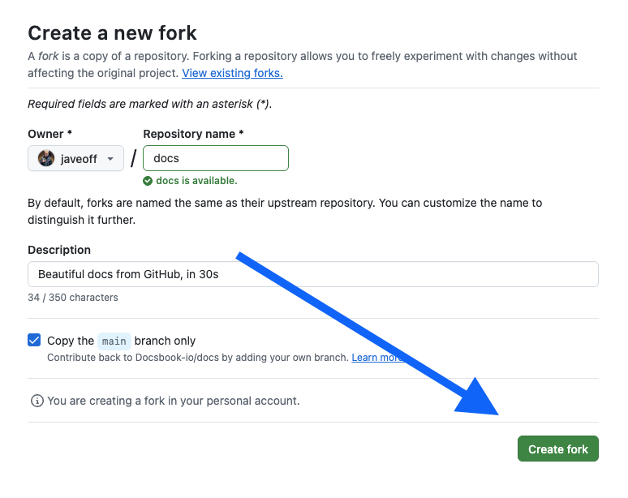

# Manage your documentation site

This guide covers what you do *after* your site is live: changing pages, undoing a change, deciding who can read it, and diagnosing a site that has not picked up your latest commit. If you have not published a site yet, start with [Create your first documentation site](./creating-docs.md).

## Open the management widget

Sign in and open your own site. A management widget appears in the bottom-right corner:

```text
+----------------------+
| Your name            |
|                      |
| Select chat        > |
| Select repo        > |
| Select mode        > |
|                      |
| Settings             |
| Sign out             |
+----------------------+
```

Click your avatar or **Settings** to open the settings panel. Everything on this page that says "Settings" starts here.

Readers never see this widget. Signed-out visitors get your documentation, your design and your content, and none of the controls.

## What you can configure in Settings

| Section | What it controls | Detail |
|---|---|---|
| Basic settings | Workspace name and default site language | — |
| Custom domain | Serve the docs from an address you own | [Custom domain](../advanced/custom-domain.md) |
| Appearance | Light, dark or follow-system theme, and the default | [Branding](../../design/style/branding.md) |
| Languages and translation | Which languages Docsbook translates into | [Translations](../../translation/settings.md) |
| Privacy and access | Public, or gated by password or your own identity provider | [Private docs](../advanced/sso.md) |
| Usage | The project balance and per-source spend ceilings | [AI usage billing](../../content/setup/pricing-spec.md) |
| Widgets | Which content widgets render on your site | [Content widgets](../../content/features/widgets.md) |

## Update a page from GitHub

1. Open your repository on github.com.
2. Open the markdown file and click the pencil icon.
3. Make your change and click **Commit changes**.

Your site picks the commit up on its own. Nothing to redeploy.

## Update pages from your computer with git

Use this when you are changing several files at once and want them reviewed together.

```bash
git clone https://github.com/YOUR_USERNAME/YOUR_REPO.git
cd YOUR_REPO
```

Edit the files in your editor, then publish them:

```bash
git add docs/
git commit -m "Update the installation guide"
git push origin main
```

Deleting a page is the same loop: delete the file, commit, push. The page disappears from the site and from the sidebar.

## Edit a page without leaving the browser

For a small correction you need neither GitHub nor a local checkout — edit the page you are reading.

1. Open the project in the Docsbook AI chat with the preview beside it (split view).
2. Switch the bar above the preview from **Preview** to **Edit**.
3. Click the block you want to change.

The panel that opens can rewrite the block with AI, edit its text directly, shorten or expand it, turn it into a [content widget](../../content/features/widgets.md), or remove it. Drag a block by its handle to move it; the new order is previewed until you click **Save** or **Revert**.

To add something rather than change it, move the pointer to the seam between two blocks. A plus button appears and offers a paragraph, a heading, a list, a code block, a quote, a callout, a table or a widget. **Add a page**, at the bottom of the sidebar, creates a whole page from a title, a folder, and an optional note on what it should cover.

Every one of these actions is committed to your repository like any other change, so your source stays the single point of truth. Rewriting a block with AI calls a model and is charged against the project's balance; editing the text yourself is not.

## Undo a change you published

Any change the assistant published can be taken back from the chat, without opening GitHub.

- **Straight away:** press the undo arrow on the card the assistant shows after publishing ("Updated 2 files").
- **Later:** open the clock icon in the chat header. It lists the project's recent changes with the files each one touched, and an undo beside every entry.

That history is your repository's real publishing history, so it also lists changes made in an earlier session, by a teammate, or directly on GitHub. All of them undo the same way.

An undo is a new commit that puts the files back, not a rewrite of history. It appears in the list as its own entry marked **Undo**, can itself be undone, and never discards anyone else's commits. If an earlier version of a file cannot be read back, it is reported as skipped rather than guessed at.

## Ask the assistant what to improve

Ask the assistant what to fix — "what should I fix first", "make this findable in search", "these pages feel thin" — and the answer comes back as a list you tick, not as prose you would have to act on by hand.

Each row is one concrete change to one of your real pages: what it changes, why it helps, and which page it touches. Some rows are a setting rather than a rewrite, and open the card that flips it. Nothing is ticked to begin with. Tick the rows you want, press **Apply** once, and every ticked row is done in a single pass. Unticked rows are never written.

The list is not guesswork: the assistant reads the documentation skill covering what you asked — search and indexing, tone, accessibility, translation — checks what it can measure about your site, checks which settings cards exist, and recommends from what those turned up. It names the skill it applied.

What **Apply** does depends on auto-mode:

| Auto-mode | What happens on Apply |
|---|---|
| Off (the default) | The changes come back as before/after diffs you approve or reject page by page |
| On | They are written and published straight away, with a summary of what changed |
| A picked setting | Its card opens in the chat so you flip the switch yourself |

Producing the list and rewriting pages both call an AI model, so both are charged against the project's balance.

## Understand the sidebar order

Docsbook reads your file names to order the sidebar:

- Pages that start a reader off — `README`, `introduction`, `getting-started`, `quick-start`, `installation`, `setup` — are listed **first**.
- Pages for looking things up — `reference`, `api`, `changelog`, `faq`, `troubleshooting` — are listed **last**.
- Everything else sits alphabetically between them. Folders are ranked by their own names the same way.

Numeric prefixes therefore still work: `1-basics.md` sorts before `2-intermediate.md` alphabetically, and the number is ignored when Docsbook checks the name against the two lists above.

If none of your pages match either list, the sidebar is plain alphabetical order. Rename a file to move it.

## Organise files into folders

The sidebar mirrors your folder structure, so the structure is the navigation. Group by topic:

```text
docs/
├── README.md
├── getting-started.md
├── api/
│   ├── overview.md
│   ├── auth.md
│   └── endpoints.md
└── guides/
    ├── deployment.md
    └── troubleshooting.md
```

Grouping by topic beats grouping by difficulty (`1-basics.md`, `2-advanced.md`), because a reader arrives from a search engine looking for a subject, not for a level.

## Link between pages

Write ordinary relative markdown links. Docsbook converts them to site URLs when it publishes.

```markdown
[Set up a custom domain](../advanced/custom-domain.md)
[Create your first site](./creating-docs.md)
[Frequently asked questions](../../faq.md)
```

Link to a heading on the same page with its anchor:

```markdown
[Jump to the sidebar order](#understand-the-sidebar-order)
```

The anchor is the heading text in lower case with spaces replaced by hyphens, so the heading has to exist for the link to land.

## Add images

1. Put the image file in your repository beside the page, for example in an `images/` folder.
2. Commit it.
3. Reference it with a relative path, and describe what it shows:

```markdown

```

PNG, JPG, GIF and WebP all render. Write real alt text on every image that carries information — it is what a screen reader announces, what a search engine indexes, and what a reader sees when the file fails to load.

## Control who can read your docs

By default a Docsbook site is **public**: anyone with the link reads it, search engine crawlers index it, and no GitHub account is needed. This holds even when the source repository is private.

To close it, switch the workspace to **private** in **Settings** → **Privacy & Access**. A reader then has to unlock it with a shared password or by signing in through your own OIDC identity provider — crawlers included. You, as the owner, always have access. Full setup: [Restrict who can read your documentation site](../advanced/sso.md).

## Work with other people

**Through GitHub.** Add them as collaborators on the repository. They edit files or open pull requests, and the site updates when a change reaches your default branch. This is the path for anyone who already works in the repository.

**Through the AI chat.** Press **Invite** in the chat toolbar and send an email invite or a link. Collaborators join the same live session, so they do not need a GitHub account. Their work draws on the same project balance yours does.

## Fix a site that has not updated

Work through these in order.

1. **Confirm the commit reached GitHub.** Open the repository and look for it. If it is not there, it was never pushed.
2. **Reload past your browser cache.** Ctrl+F5, or Cmd+Shift+R on macOS. A private window is the fastest way to rule the cache out.
3. **Give it a couple of minutes.** Publishing is not instantaneous; Docsbook checks the repository periodically rather than on every keystroke.
4. **Check the file extension.** Only `.md` files are published.
5. **Check the file name.** Latin letters, digits and hyphens are safe; other characters may not produce a URL.

If some pages updated and others did not, it is almost always the browser cache rather than the sync — a partial update is not a state Docsbook publishes.

## Versioning

Docsbook serves one version of your documentation: the current state of your branch. Multiple published versions side by side are not supported today.

If you need them now, keep versions in separate branches (`docs/v1`, `docs/v2`) or in separate repositories, and connect the one you want published.

## See who is reading

Open Float Widget → **Analytics**. Views, visitors, top pages, referrers and search queries are reported per page, so you can see which pages earn their traffic and which sit unread.

Two reports answer most questions about a page: [Web analytics](../../analytics/tracking/overview.md) for traffic, and [page feedback](../../ai-chat/feedback.md) for whether readers who arrived got what they needed.

## Delete a workspace

**Settings** → **Delete Workspace** removes the documentation site and every setting on it. It cannot be undone.

Your GitHub repository is untouched. The markdown stays where it always was, so deleting a workspace loses configuration, not content.

## Next steps

- [Set up a custom domain](../advanced/custom-domain.md) — serve the docs from an address you own.
- [Translate your documentation](../../translation/README.md) — 15 languages, each indexed separately.
- [What Docsbook includes and what costs money](../advanced/premium.md) — which actions draw on the project balance.
- [Frequently asked questions](../../faq.md) — the questions readers ask before they commit.
