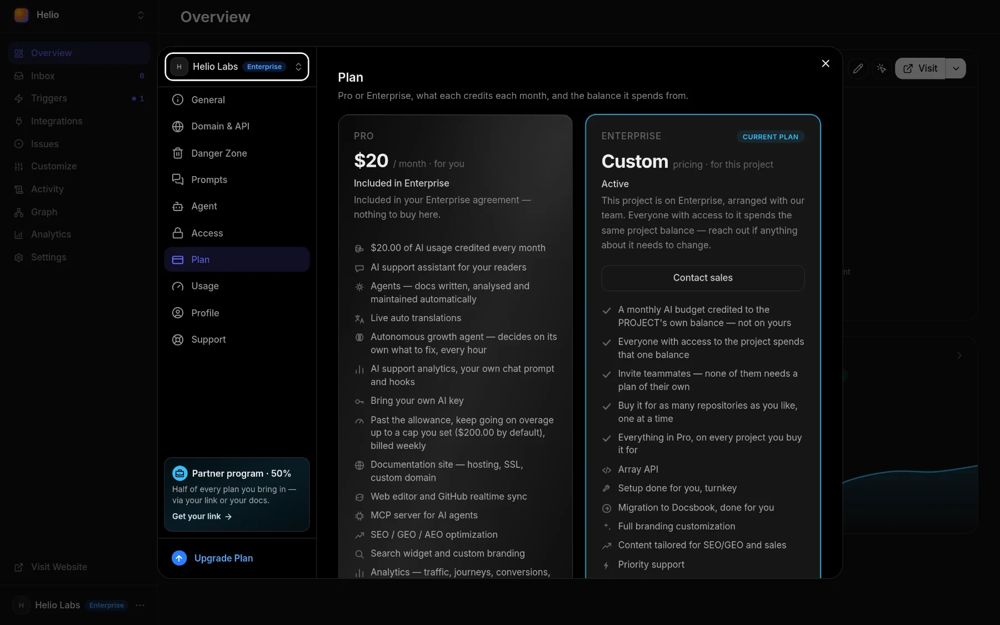
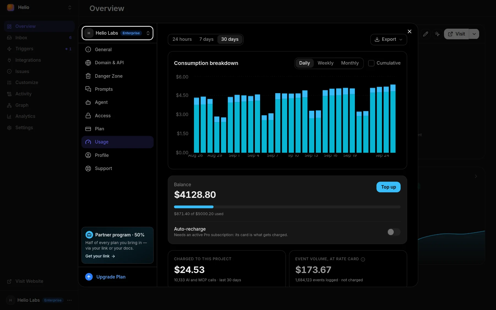

# Pricing

Your docs stay published for free, and you pay for AI work: Pro is $20 a month, or $200 a year with two months free, and every month comes back as $20 of AI usage.

<!-- widget:pricing size=large cols=3 -->

## Free {rocket}

**$0** / mo

For docs that don't need AI yet

Unlimited projects and editors

- Hosting, SSL and a custom domain
- Web editor and GitHub sync
- Search and custom branding
- SEO and GEO markup on every page
- MCP server for AI agents
- Private docs and access control

[Create a site](https://docsbook.io/create)

## Pro {sparkles}

Monthly: **$20** / mo

Annual: **$200** / yr · 2 months free

For docs that run on AI

$20 of AI usage credited every month

- Everything in Free {circle-plus}
- AI chat that answers your readers
- Agents that write, audit and maintain the docs
- Live auto translations
- Search by meaning
- Analytics dashboards
- Your own chat prompt and hooks

[Start the 14-day trial](https://docsbook.io/create)

## Enterprise {building-2}

**Custom** pricing

For a team on one shared balance

Teammates need no plan of their own

- Everything in Pro {circle-plus}
- One balance everyone on the project spends
- Bring your own AI key
- Setup and migration done for you
- SSO, SCIM and RBAC
- A dedicated support engineer

[Contact sales](mailto:support@docsbook.io?subject=Docsbook%20Enterprise)

<!-- /widget -->

Every account starts with a 14-day Pro trial with $5 of AI credit and no card. Almost everything is in Pro: Enterprise adds a shared project balance, your own AI key and our team, not features Pro is missing.

<!-- widget:pricing compare -->

[Create a site](https://docsbook.io/create) · [Start the trial](https://docsbook.io/create) · [Contact sales](mailto:support@docsbook.io?subject=Docsbook%20Enterprise)

| Platform {layout-grid} | Free {rocket} | Pro {sparkles} | Enterprise {building-2} |
|---|---|---|---|
| Projects | Unlimited | Unlimited | Unlimited |
| Editors | Unlimited | Unlimited | Unlimited |
| Hosting and SSL | ✓ | ✓ | ✓ |
| Custom domain | ✓ | ✓ | ✓ |
| Web editor | ✓ | ✓ | ✓ |
| GitHub sync | ✓ | ✓ | ✓ |
| Search | ✓ | ✓ | ✓ |
| Custom branding | ✓ | ✓ | ✓ |
| Content widgets | ✓ | ✓ | ✓ |
| SEO and GEO markup | ✓ | ✓ | ✓ |
| MCP server | ✓ | ✓ | ✓ |
| Private docs and access control | ✓ | ✓ | ✓ |

| AI {sparkles} | Free | Pro | Enterprise |
|---|---|---|---|
| AI usage included | — | $20 / month | Custom |
| AI chat for readers | — | ✓ | ✓ |
| Agents | — | ✓ | ✓ |
| Autonomous growth agent | — | ✓ | ✓ |
| Live auto translations | — | ✓ | ✓ |
| Search by meaning | — | ✓ | ✓ |
| Own chat prompt and hooks | — | ✓ | ✓ |
| Overage past the allowance | — | Up to $200 / month | Custom |
| Bring your own AI key | — | — | ✓ |

| Analytics {chart-line} | Free | Pro | Enterprise |
|---|---|---|---|
| Traffic, sources and journeys | — | ✓ | ✓ |
| Chat questions and dead ends | — | ✓ | ✓ |
| Google Search rankings | — | ✓ | ✓ |
| Bot crawls a month | 5,000 | 100,000 | 500,000 |

| Support {life-buoy} | Free | Pro | Enterprise |
|---|---|---|---|
| Email support | ✓ | ✓ | ✓ |
| Setup and migration done for you | — | — | ✓ |
| SSO, SCIM and RBAC | — | — | ✓ |
| Priority support | — | — | ✓ |
| Dedicated support engineer | — | — | ✓ |

<!-- /widget -->

Prices are in US dollars, billed monthly or yearly through Paddle; a yearly Pro still credits $20 of AI usage every month. You manage or cancel a subscription with **Manage subscription** on **Settings ▸ Plan**.

## How does the free trial work?

Every account gets one Pro trial, with no card and nothing to switch on:

- **14 days, once per person** — every project you create runs on Pro, counted from the first time you open one
- **$5 of AI credit** — spent before any credit you add; the AI stops when 5% of it is left, and the site keeps serving
- **Nothing is ever charged** — with no card on file there's no overage and no bill
- **Subscribe early, keep the days** — add a card during the trial and the first $20 charge lands when the trial ends; that month credits $20 minus what you used of the $5

When the trial ends without a subscription or a top-up, your projects move to Free together:

- **Still on** — the published site, its search, your domain, the editor and GitHub sync
- **Switched off** — AI chat for readers, agents and auto translations
- **Hidden, not deleted** — analytics keep being collected, and they come back when you subscribe or top up

## What uses the balance?

Anything that runs a model or does work for you comes off one balance: the plan's monthly credit first, then credit you topped up, then overage on a paid plan.

| What | How it's priced |
|---|---|
| **AI chat answers**, for readers and in the panel | Twice the model provider's price for the tokens it used |
| **Translations** | The same rate |
| **Semantic index** — embedding your pages so chat and search find them by meaning | The same rate |
| **Agent runs** — `docsbook_agent` jobs and the triggers that start them | $0.10 per run plus twice what its model tokens cost, capped at $50 a run |
| **MCP and API calls** | Twice what serving the call costs us: discovery is free and most calls cost $0.01–$0.16 per 1,000; a call that uses model tokens or a paid data source adds twice their price |
| **Bot crawls** | 5,000 pages a month free on Free, 100,000 on Pro, 500,000 on Enterprise; $0.30 per 1,000 pages after that |

Each model on **Settings ▸ Agent** shows its billed price per 1M tokens, so you can pick a cheaper one to make the balance last longer. Every tool's own price is on its page in the [MCP tools reference](./mcp-tools/README.md) and the [API reference](./rest-api/README.md) — a tool costs the same over both.

Only AI and search crawlers count as crawls; a person who clicks through from an AI answer is a reader. When the allowance and the balance are both used up, crawlers get `429 Too Many Requests` until next month or a top-up, and people reading your docs are never turned away.

## Top-ups, overage and your own key

A plan's monthly credit is the base. Three things extend or replace it:

- **Top-ups** — a one-off payment from $20 up to $5,000; nothing recurs and the credit never expires. It lands on the balance every project of the same owner shares — your account's, or your team's
- **Overage** — with a paid Pro subscription, usage past the monthly credit and your top-ups continues up to $200 a month, which is both the default cap and the ceiling, charged to your card every 7 days
- **Your own AI key** — on Enterprise, add an OpenRouter, OpenAI, Google Gemini, Anthropic or Vercel AI Gateway key on **Settings ▸ Agent ▸ Your own AI API Key**; your provider bills those calls and Docsbook charges nothing for them

**Settings ▸ Usage** shows what the balance went on over the last 24 hours, 7 or 30 days — AI calls, MCP calls and crawls — and what is left.

## FAQ

<!-- widget:accordion -->

### Is there a free plan?

There's no free plan to buy, and no deadline on your docs either: after the trial a project without a plan stays published for free, without the AI features.

### Is the balance per project?

No, it's one balance per owner. Every project on your account spends your balance, and projects in a team spend the team's; Pro bought from your account's or team's **Settings ▸ Plan** covers every project there.

### What happens when the balance runs out?

On a paid plan, usage continues as overage up to your cap, and then the AI pauses until the next month or a top-up. Without a plan the AI stops. The balance never takes your site offline.

### Can I leave?

Yes. Cancel from **Manage subscription**, and take your pages with you: they are plain Markdown in a Git repository, so nothing is locked in.

<!-- /widget -->

## Next steps

<!-- widget:cards plain cols=2 arrow=hover -->

- [Quickstart](./quickstart.md) — Create a site and start the trial {rocket}
- [Tell your agent, get discovered](./get-discovered.md) — What one request to the agent does, and costs {bot}
- [AI chat](./ai-chat/README.md) — The assistant that answers your readers {message-circle}
- [Translations](./site/translations.md) — Serve the docs in more languages {languages}

<!-- /widget -->
