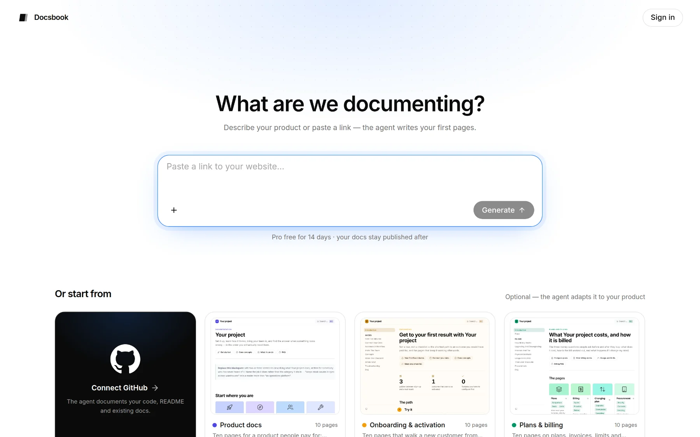
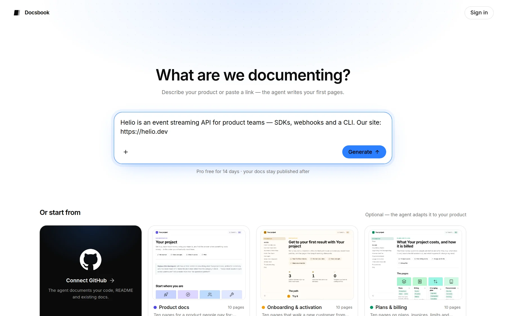
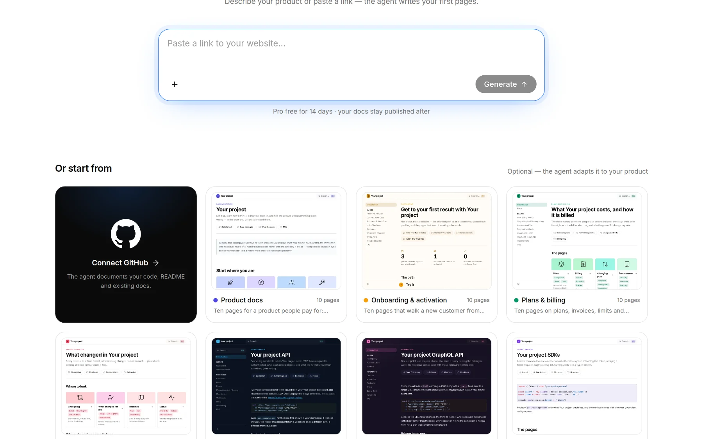
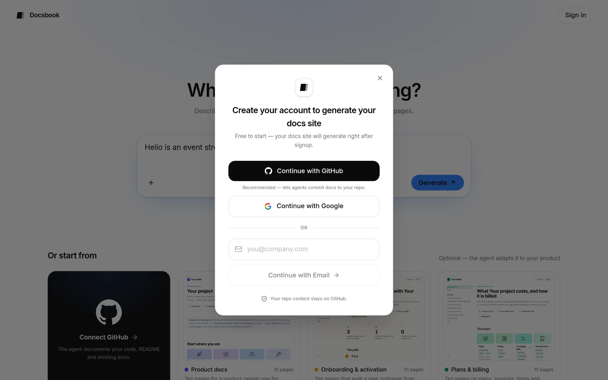
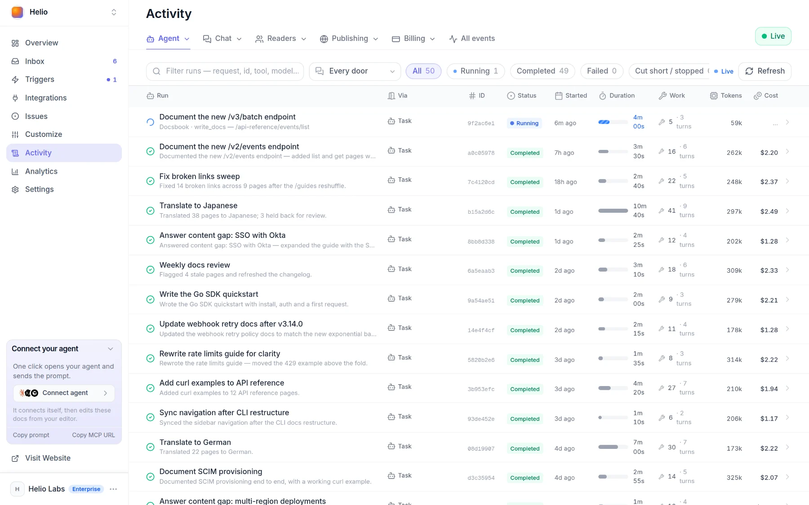

# Quickstart

Open [docsbook.io/connect](https://docsbook.io/connect), say what you're documenting and press **Generate**. The Docsbook agent writes your first pages while you watch.

Nothing to install and no card. A GitHub account is optional, and every new account starts with a 14-day Pro trial that includes $5 of AI credit ([pricing](./pricing/plans.md)).

## Create your site

It all happens on one screen, **What are we documenting?** — for a new visitor and a signed-in owner alike. **Create new project** in the panel's project switcher opens the same screen.



<!-- widget:stepper -->

### Describe your product or paste a link

Type a few sentences about your product, paste a link, or both in one message. The field takes your website, your current docs on Mintlify or GitBook, or a GitHub repository as `github.com/owner/repo`.



- **A description** — the fact the agent trusts first, over any site or file
- **A website link** — read for your colours, logo and fonts, and connected as a [source](./brain/sources.md); up to five sites in one message
- **A Mintlify or GitBook link** — your existing docs, moved over page by page
- **A GitHub repository link** — imports that repository as the site

### Attach files and screenshots

**+** adds files or takes a screenshot; dropping or pasting works too. PDF, DOCX, Markdown and text files are material the agent turns into pages.

Pictures are saved to the new site's `assets/` folder for the agent to place on the right page. An imported repository gets nothing written at creation, so pictures are left out there. A file can be up to 15 MB, a picture up to 5 MB.

### Pick a starting point, if you want one

Under **Or start from**, the first card is **Connect GitHub** — or **Choose a repository** once GitHub is connected, which swaps the gallery for your repositories. Every other card is a template, pictured with the pages it will create; more load as you scroll.



A pick gets a blue frame, and a second click undoes it. A template and a repository exclude each other. Without a template, the agent designs the structure itself.

### Press Generate and sign in

**Generate** is the only button that creates anything. Signed out, it opens **Create your account to generate your docs site**: **Continue with GitHub** (recommended — it lets agents commit docs to your repo), **Continue with Google**, or your email and a 6-digit code.



What you typed, attached and picked survives the sign-in, and the project is created as soon as you're in.

### Watch the first run

When the first run starts, you land on **Activity ▸ Agent ▸ Agent runs**, where it is already writing. Open its row for a live step-by-step trace; the agent's report arrives in **Inbox** when it's done.



<!-- /widget -->

## What does the first run do?

Which run starts depends on what you gave it:

| You gave | The run | What it does |
|---|---|---|
| A GitHub repository | **Generate docs from your repository** | Adds pages beside your files — getting started, configuration, usage, a reference for what the code exposes. It never rewrites, moves or deletes a file of yours, and every command and name it writes exists in the code. |
| A website, Mintlify or GitBook link | **Generate docs from your site** | Reads about ten pages of your site — pricing, features, existing docs — and writes your docs from them. Existing docs are moved page by page, up to about thirty. |
| Only a description or files | **Generate docs from your brief** | Drafts the docs from your material alone, never goes looking for a site, and leaves out what it has nothing to say about. |

A picked template is kept and filled in with your product's real names, features and steps. Each run also fills settings that are still empty — **Product website**, product description, support email, **Call To Action URL** and the site's name — and never replaces your own words.

It is told never to invent a price, a limit or an integration: what it can't confirm comes back as questions in the report.

## Which starting point fits?

<!-- widget:tabs -->

Only importing a repository needs GitHub. Anything else runs on a repository Docsbook creates and hosts for you.

### Your repo {git-branch}

Paste `github.com/owner/repo`, or choose **Connect GitHub** and then your repository, and press **Generate**. Its Markdown stays the site, and **Generate docs from your repository** adds the missing pages beside it as a pull request.

### Your website {globe}

Paste your site's address, or your Mintlify or GitBook docs, and add a sentence about the product if you like. **Generate docs from your site** writes your docs from what it reads there.

### A description {file-text}

No site yet? Describe the product in a few sentences and attach any files or screenshots. **Generate docs from your brief** drafts the docs from that material alone.

<!-- /widget -->

## Where does your site live?

Every site gets a `docsbook.io` address the moment it's created:

| You started from | Your site's address |
|---|---|
| A link, a description or a template (Docsbook hosts the repo) | `https://<project-name>.docsbook.io`, named after your site when you gave one |
| Your GitHub repository | `https://<owner>.docsbook.io/<repo>` |
| Either, on your own domain | `https://docs.example.com` — see [custom domain](./site/custom-domain.md) |

Change the name in the address on **Settings ▸ General ▸ Site source**; nothing on GitHub moves.


For a repository site, `docsbook.io/<owner>/<repo>` redirects to its address too.

## Hand the rest to your agent

From here the Docsbook agent does the work. Paste one sentence into Claude Code, Cursor, Codex or ChatGPT and it connects itself:

```text
Set up Docsbook for me. Fetch https://docsbook.io/get-started.md and follow it.
```

Then ask for outcomes in your own words — "document our API from the repo", "get us cited in AI answers" — as [Tell your agent, get discovered](./get-discovered.md) shows. To keep work coming without asking, arm ready-made [triggers](./agent/triggers.md) such as **Organic search audit** or **Answer what the chat could not**.

## FAQ

**Does Docsbook change my repository?** Importing writes nothing into it. When you press **Generate**, **Generate docs from your repository** adds new pages beside your files and never rewrites, moves or deletes one. Each change the agent makes arrives as a pull request that merges itself or waits for you, set on **Settings ▸ General ▸ When a change goes live** ([reviewing changes](./agent/review.md)).

**Why didn't the first run start?** It runs once, for a new project with something to work from — a description, a link, a repository or files — and only when your balance covers a run. A template on its own is not enough. Without a run your attached files are published as pages as they are, and you can ask the agent at any time.

**Does connecting a repository from the panel start a run?** No. Connecting one from the panel's project switcher only imports it; the creation run starts when you press **Generate** on [docsbook.io/connect](https://docsbook.io/connect).

## Next steps

<!-- widget:cards plain cols=2 arrow=hover -->

- [Tell your agent, get discovered](./get-discovered.md) — Connect your agent over MCP and ask for outcomes {bot}
- [Find wins fast](./find-wins-fast.md) — How the agents pick the change that moves a number {target}
- [Edit and publish](./site/editing.md) — The editor, GitHub sync and your hosted repo {file-text}
- [Custom domain](./site/custom-domain.md) — Serve the docs from your own domain {globe}

<!-- /widget -->
