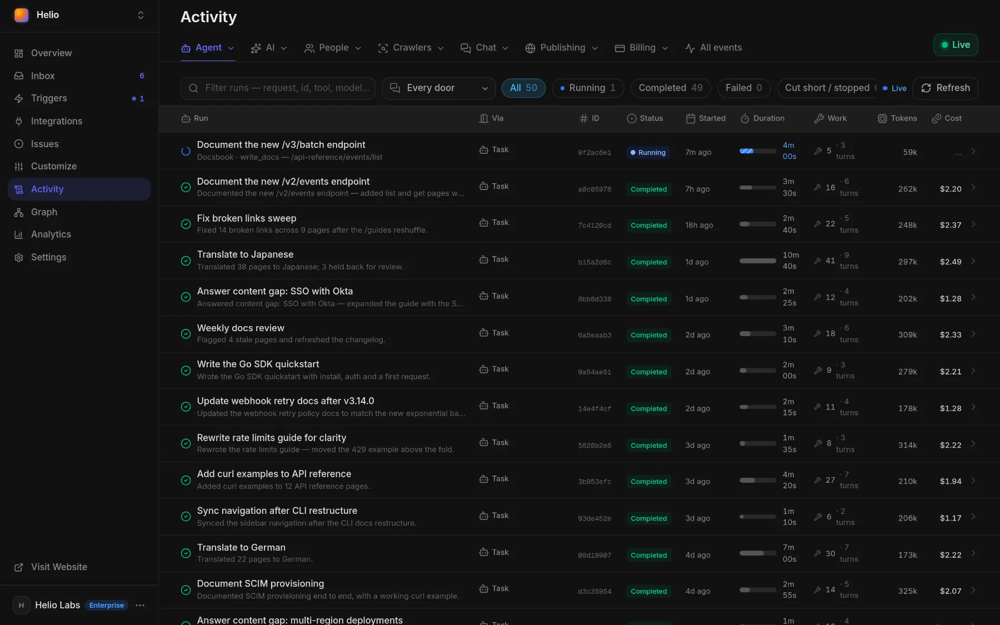
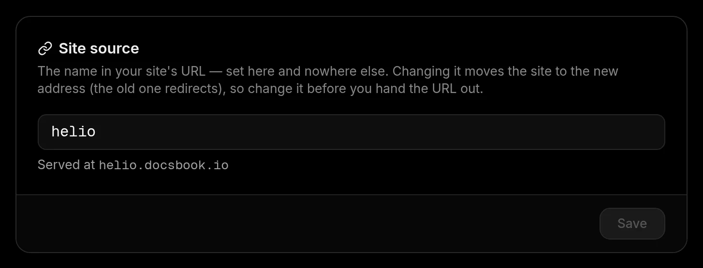

# Quickstart

Open [docsbook.io/connect](https://docsbook.io/connect), describe your product or paste a link, and press **Generate**: your documentation site is live the moment you sign in, and the Docsbook agent is already writing its first pages.

Nothing to install and no card. A GitHub account is optional, and every new account starts with a 14-day Pro trial that includes starter AI credit ([pricing](./pricing/plans.md)).

## Create your site

The creation screen asks one question — **What are we documenting?** — in a single field with a **Generate** button. Already signed in, **Create new project** in the panel's project switcher opens the same screen.

<!-- widget:stepper -->

### Describe it or paste a link

Type a few sentences about your product, or paste your website, your Mintlify or GitBook docs, or a `github.com/owner/repo` link. **+** attaches files or a screenshot. The description is read by your agent, never published as it is.

### Pick a starting point, if you like

Under **Or start from**, the first tile is your code: **Connect GitHub**, or **Choose a repository** once GitHub is connected. Every other tile is a template — 37 of them, from **One page** to **REST API** — pictured with the pages it will create. Both are optional: with no template, the agent designs the structure itself.

### Press Generate and sign in

Signed out, you choose **Continue with GitHub** (recommended — it lets agents commit to your repo), **Continue with Google** or **Continue with Email** with a 6-digit code. What you typed and picked survives the sign-in, and the project exists as soon as you're in.

### Watch the first run

You land on **Activity ▸ Agent runs** with the site already live and the one-time creation run already writing: **Generate docs from your repository** when you picked or pasted a repository, **Generate docs from your site** when you gave a website, and **Generate docs from your brief** otherwise. The agent's report arrives in **Inbox**.



<!-- /widget -->

The run replaces placeholder wording with your product's real names, features and steps. It is told never to invent a price, a limit or an integration: what it can't confirm comes back as questions in the report.

## Which starting point fits?

<!-- widget:tabs -->

Only a repository of your own needs GitHub. Everything else runs on a repository Docsbook creates and hosts for you.

### Your repo {git-branch}

Choose **Connect GitHub**, then your repository, and press **Generate** — or paste its `github.com/owner/repo` link into the field. Its Markdown becomes the site, and **Generate docs from your repository** reads the README, the code and the pages you have, then adds the missing pages beside them. It never rewrites, moves or deletes one of your files. Importing a repository from the panel's sidebar in one click publishes it as it stands and starts no run.

### Your website {globe}

Paste your site into the field — or your existing Mintlify or GitBook docs. **Generate docs from your site** reads about ten of its pages, pricing, features and existing docs first, moves existing docs over page by page, and writes the pages about your product: into the template you picked, or into a structure it designs.

### A description {file-text}

No site yet? Describe the product in the field and attach any files or screenshots with **+**. **Generate docs from your brief** drafts the docs from that material alone, and with a template picked, removes the template pages it says nothing about.

<!-- /widget -->

## Where does your site live?

Every site gets a `docsbook.io` address the moment it's created:

| You started from | Your site's address |
|---|---|
| A description, a link or a template (Docsbook hosts the repo) | `https://<project-name>.docsbook.io` |
| Your GitHub repository | `https://<owner>.docsbook.io/<repo>` |
| Either, on your own domain | `https://docs.example.com` — see [custom domain](./site/custom-domain.md) |

Change the name in the address on **Settings ▸ General ▸ Site source**; nothing on GitHub moves. For a repository site, `docsbook.io/<owner>/<repo>` redirects to its address too.



## Hand the rest to your agent

From here the Docsbook agent does the work. Paste one sentence into Claude Code, Cursor, Codex or ChatGPT and it connects itself:

```text
Set up Docsbook for me. Fetch https://docsbook.io/get-started.md and follow it.
```

Then ask for outcomes in your own words — "document our API from the repo", "get us cited in AI answers" — as [Tell your agent, get discovered](./get-discovered.md) shows. To keep work coming without asking, arm ready-made [triggers](./agent/triggers.md) such as **Organic search audit** or **Answer what the chat could not**.

## FAQ

**Does Docsbook change my repository?** Not on a one-click import from the panel. With **Generate**, the first run only adds pages beside yours and never rewrites your files. Every change the agent makes, the first run's included, arrives as a pull request that merges itself or waits for you, set on **Settings ▸ General ▸ When a change goes live** ([reviewing changes](./agent/review.md)).

**Why didn't the first run start?** It runs once, only for a new project made with **Generate** from something to work from — a description, a link, a repository or files; a template alone isn't enough — and only when your balance covers a run. Otherwise your attached files are published as pages as they are, and you can ask the agent at any time.

## Next steps

<!-- widget:cards plain cols=2 arrow=hover -->

- [Tell your agent, get discovered](./get-discovered.md) — Connect your agent over MCP and ask for outcomes {bot}
- [Find wins fast](./find-wins-fast.md) — How the agents pick the change that moves a number {target}
- [Edit and publish](./site/editing.md) — The editor, GitHub sync and your hosted repo {file-text}
- [Custom domain](./site/custom-domain.md) — Serve the docs from your own domain {globe}

<!-- /widget -->
