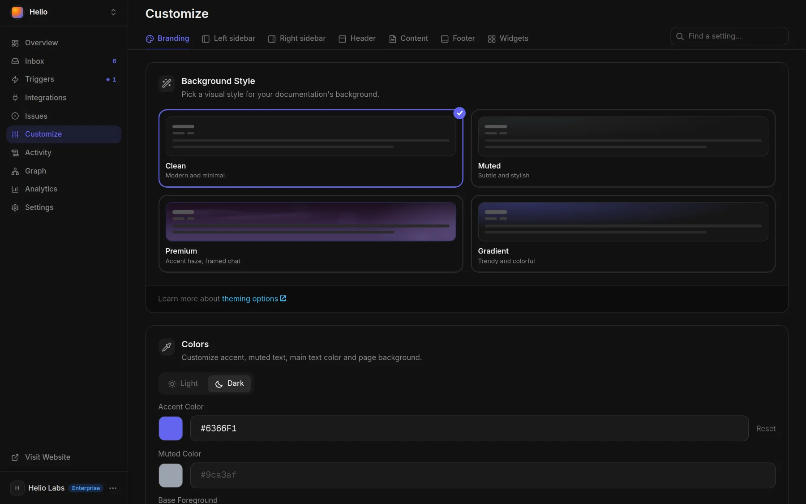

# Brand your docs

Everything readers see around your content (logo, colors, fonts, header, sidebars, footer) is set in **Customize**, and your agent can set any of it from one sentence.



Created the project from your website's address? Docsbook already read its accent color, font, logo, favicon, header links, social links and main call to action, so the site starts in your brand.


## What each Customize tab controls

| Tab | Cards on it |
|---|---|
| **Branding** | Background Style, Colors, Project Icon, Logo, Font, Default Theme |
| **Left sidebar** | Theme Toggle, Language Toggle, Search Bar, Collapsible Top-Level Folders, Folder Visibility, Sidebar Icons |
| **Right sidebar** | Scroll to Top, Ask AI, Copy as Markdown, Rate Page, Edit on GitHub |
| **Header** | Header Layout, Search in Header, Ask AI in Header, Language in Header, Theme Toggle in Header, Navigation Links, Social Links, Subheader Folders |
| **Content** | Reading aids, Home page as a landing page, Rate this page, Copy page menu, Ask AI Entry Points |
| **Footer** | Site Footer, Footer Layout, Footer Links, Footer Brand Block, Footer Extras |
| **Widgets** | A switch for each [page widget](./widgets.md) |

A change is live as soon as you save it. The **Find a setting…** box filters the cards on the tab you're on.

## Colors, fonts and theme

The **Branding** tab sets the look of every page.

- **Colors** — one accent for both themes, plus muted text, main text and background, set separately under **Light** and **Dark**.
- **Font** — any Google Font, one for headings and one for body text, with a live preview.
- **Background Style** — **Clean**, **Muted**, **Premium** (accent light across the top of the page, a card-style chat) or **Gradient**.
- **Default Theme** — what a first-time reader gets: light, dark or system. Readers switch with the theme toggle in the sidebar footer, the header or the footer.
- **Logo** and **Project Icon** — image URLs for the header logo and the browser-tab icon. The site's name is **Project Name** in **Settings ▸ General**.

## Header, sidebars and footer

The other tabs arrange the frame around your pages.

- **Header Layout** — five presets: Classic, Search-centric, Search + Ask AI, Centered and Minimal.
- **Navigation Links** — links across the header; give one a button color and it becomes your call-to-action button.
- **Social Links** — GitHub, Twitter / X, LinkedIn, YouTube and Slack icons.
- **Subheader Folders** — top-level folders shown as tabs under the header.
- **Sidebar Icons** and **Folder Visibility** — an icon beside any page or folder, and folders kept out of the sidebar.
- **Footer** — off until you turn on **Site Footer**; then up to six columns of links, a copyright line, your logo, a button, social icons and a theme picker, in one of three layouts.
- **Home page as a landing page** — hides the sidebar, the outline and the page chrome on the front page only, and sets its sections in larger type.

You can also click the header, a sidebar entry or the footer on the page itself, in [interactive mode](./editing.md): each offers its own actions, such as **Rename** or **Hide**.

<!-- widget:callout type=note -->

The **Powered by Docsbook** link stays on every plan, under each page or in the footer's bottom bar. It carries your partner link: a reader who subscribes after clicking it earns you 50% of their monthly plan.

<!-- /widget -->

## Tell your agent

Your agent sets all of this with `update_branding` (colors, fonts, logo, theme), `update_navigation` (header, sidebar and footer links, sidebar labels and icons) and `update_ui_settings` (every show and hide switch), on every plan.

```text
Use the colors, fonts and logo from acme.com.
Add a Pricing button to the header in our accent color.
Turn on the footer with our copyright line and links to Terms and Privacy.
Make the home page a landing page.
```

Send it from the panel chat or from [your own agent](../get-discovered.md); the tools are listed in the [MCP tools reference](../mcp-tools/README.md).

## FAQ

**Can I add my own CSS?** No. The Customize cards are the whole styling surface, for you and for your agent.

**Do I need a paid plan to brand my docs?** No. Every Customize setting works on every plan, including Free.

## Next steps

<!-- widget:cards plain cols=2 arrow=hover -->

- [Page widgets](./widgets.md) — Cards, tabs, steps and 15 more blocks for your pages {layout-grid}
- [Custom domain](./custom-domain.md) — Serve the docs on your own domain {globe}
- [Edit and publish](./editing.md) — The editor, GitHub sync and review mode {pencil}
- [Translations](./translations.md) — The same site in 15 languages {languages}

<!-- /widget -->
