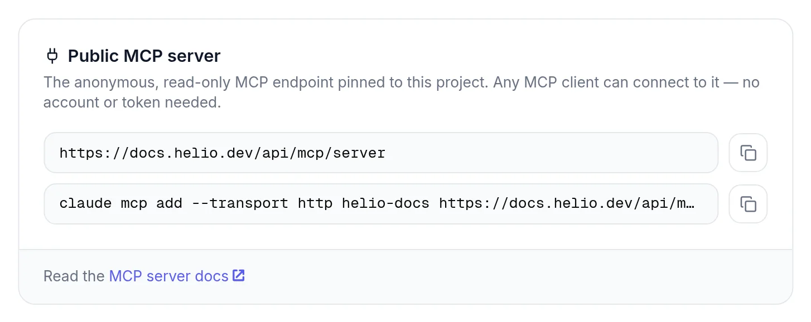
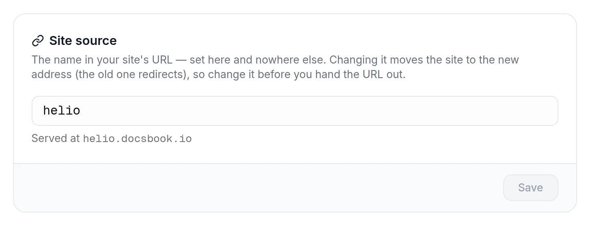

# Put your docs on your own domain

Serve your docs at an address you own, such as `docs.acme.com`, with one DNS record; the SSL certificate is free and issued automatically.

<!-- widget:stepper -->

### Add the domain in Docsbook

Open **Settings ▸ Domain & API**, type the domain in **Custom Domain**, for example `docs.acme.com`, and save:

### Add one DNS record where your domain is managed

| Your domain | Type | Name / Host | Value |
|---|---|---|---|
| A subdomain such as `docs.acme.com` (recommended) | `CNAME` | `docs` | `cname.vercel-dns.com` |
| A root domain such as `acme.com` | `A` | `@` | `76.76.21.21` |

Some DNS providers want the full name, `docs.acme.com`, in the **Name** field instead of `docs`.

### Open the site

When `https://docs.acme.com` shows your docs, you're done. The certificate is issued as soon as the record resolves, and DNS changes can take from minutes to hours to reach everyone.

<!-- /widget -->

The first two steps work in either order, so you can add the DNS record first.

## What changes when the domain is live

- **Every page** answers at your domain's root: `docs.acme.com/quickstart`, and [translations](./translations.md) at `docs.acme.com/de/quickstart`.
- **Search engines** are told each page's canonical address is on your domain, so ranking builds up there. The docsbook.io address keeps working.
- **Your [public MCP server](../brain/mcp-server.md)** moves too: `https://docs.acme.com/api/mcp/server`, shown in **Settings ▸ Domain & API ▸ Public MCP server**.
- **Some extras stay on the docsbook.io address for now** — the sitemap, `llms.txt`, `hreflang`, moved-page redirects and most structured data; see [Search engines see you](../seo/README.md).

To go back to the docsbook.io address, clear the **Custom Domain** field and save; to switch domains, enter the new one. The docsbook.io address itself is set in **Settings ▸ General ▸ Site source**:

## Which plans include it

Custom domains and their certificates are part of every plan. One exception: while the 14-day free trial runs, the domain can't be set or changed until the plan is paid for. Removing a domain always works. Details in [Plans and pricing](../pricing/plans.md).

## Tell your agent

Tell your agent: "Point `docs.acme.com` at our docs." It sets the domain with `update_domain`; the DNS record is still yours to add. Connect an agent from [Tell your agent, get discovered](../get-discovered.md).

## Troubleshooting

<!-- widget:accordion -->

### Saving fails because the domain is already in use

Another hosting project still claims the domain, for example a Vercel project you set it up on earlier. Remove it there, then save again.

### It never goes live behind Cloudflare

Set the record to **DNS only** (the grey cloud). A proxied record gets in the way of verification and of the certificate.

### The browser warns about the certificate

The certificate is issued after the record resolves. Wait, reload, and if the warning stays, compare the record with the table above character by character.

### How do I check the record myself?

Run `dig docs.acme.com CNAME +short`: it should print `cname.vercel-dns.com.` For a root domain, `dig acme.com A +short` should print `76.76.21.21`.

<!-- /widget -->

## Next steps

<!-- widget:cards plain cols=2 arrow=hover -->

- [Brand your docs](./branding.md) — Logo, colors, fonts, header and footer {palette}
- [Private docs](./private-docs.md) — Put a password or SSO in front of the site {lock}
- [Search engines see you](../seo/README.md) — What the agent does for your rankings {search-check}
- [Public MCP server](../brain/mcp-server.md) — Let your readers' agents query the docs {plug}

<!-- /widget -->
