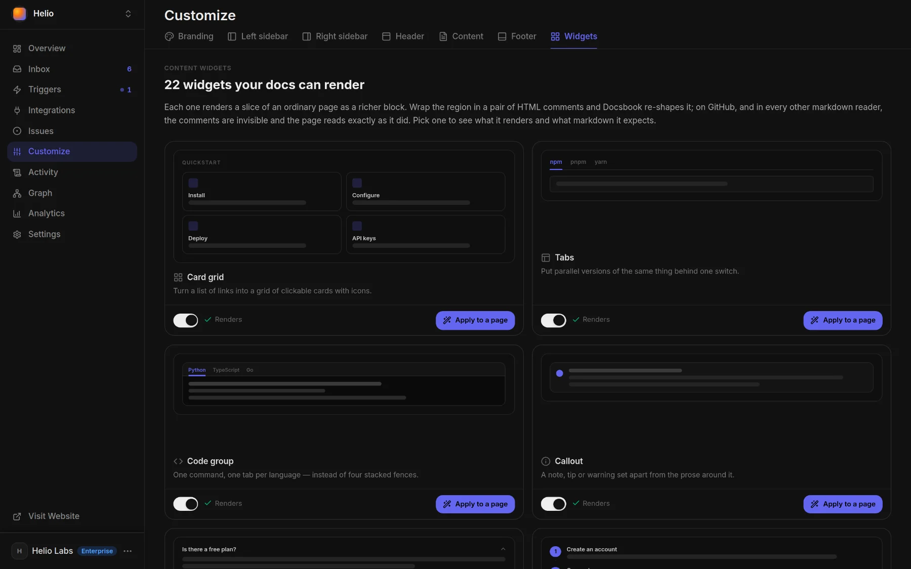

# Page widgets

Wrap plain Markdown in two HTML comments and Docsbook renders it as a card grid, tabs, steps or one of 20 other widgets, while on GitHub the page still reads as ordinary Markdown.

## How a widget marker works

Put an opening comment that names the widget on its own line before the region, and the closing comment on its own line after it:

```markdown
<!-- widget:callout type=tip -->

A custom domain needs one DNS record. See [Custom domain](./custom-domain.md).

<!-- /widget -->
```

On the site, that becomes:

<!-- widget:callout type=tip -->

A custom domain needs one DNS record. See [Custom domain](./custom-domain.md).

<!-- /widget -->

- **Blank lines** — leave one between each marker and the content.
- **Options** — go inside the opening comment, after the name, such as `cols=2 plain` for `cards`; an unknown option is ignored.
- **No nesting** — a widget can't hold another widget.
- **Safe failure** — an unknown name or a missing closing marker leaves the region as plain Markdown, so nothing is ever hidden.

## Every widget

| Widget | What it renders | Use it for |
|---|---|---|
| `cards` | A grid of link cards with icons or images | Hubs, and the "Next steps" at the end of a page |
| `tabs` | Headed sections as one tab strip | The same instructions for different systems, package managers or SDKs |
| `code-group` | Code blocks with a language switcher | One command or call in several languages |
| `callout` | An aside: note, info, tip, success, warning or danger | The sentence a reader must not miss |
| `accordion` | Collapsible rows | FAQs, troubleshooting, reference to scan |
| `stepper` | Numbered, connected steps | A procedure followed in order |
| `pricing` | Plan cards with a Monthly/Annual switch, or a feature comparison with a sticky plan header (`compare`) | Choosing between plans |
| `api` | An endpoint playground with a request form | Letting readers send a real REST call |
| `mcp` | An MCP tool's signature and arguments | Documenting one MCP tool |
| `cta` | A compact block with buttons | The one next step on a page |
| `cta-form` | The same block with one input field | A next step that starts with an email or a URL |
| `cta inbox` | Slack thread over Inbox reports — messages above, email-like report items below | Closing a front page with the agent's conversation with the team |
| `recommendations` | Ranked findings with severity badges | "Fix this first" lists and audit results |
| `hero` | An opener with a lead, quick links and a prompt for the reader's agent | A docs home or a section landing page |
| `showcase` | A gallery led by screenshots | Customer sites, templates, examples |
| `stats` | A band of three or four large numbers | Checkable figures on a landing page |
| `journey` | Lifecycle stages, each with destination cards | "Where am I, and what's next" overviews |
| `bento` | Mixed-width feature cards with screenshots, trigger stacks, or count tiles | Showing what a product looks like |
| `logos` | A row of customer logos | Social proof under a hero |
| `stories` | Coloured post cards filtered by category chips | A blog or case-study index |
| `story` | A post header with a brand panel, the lead and a fact column | The top of a blog post |
| `quote` | A quotation on a card with the speaker's name and role | A real quote in a post |

### Bento card extras

The `bento` widget takes two special modifiers on its items:

- **`{triggers}`** — renders the item's first nested list as a stack of trigger rows dissolving upwards instead of a screenshot. Each row follows `- **Name** — When · what it does {icon} {schedule|event|github} {badge:…} {on}`.
- **`{count:N}`** — renders one large icon tile with the number pinned to its corner instead of a screenshot. For cards where a single figure is the point (connectors, rules, languages).

### CTA inbox

The `cta inbox` shape is a front-page element: title left, supporting line right, then a Slack-style message thread laid over Inbox reports that fade out to the edges. Write two lists — `### Thread` for the chat messages, then `### Inbox` for the reports. Without both lists it falls back to the regular compact `cta` block.

Each widget's full contract and a copyable example are in **Customize ▸ Widgets** and in `list_content_widgets`. The **Next steps** block at the end of this page is a `cards` widget.

## Lay out a blog

A blog index and its posts read best without the docs sidebar. Put `layout: landing` in a page's frontmatter and that page drops the sidebar, the on-this-page outline, breadcrumbs, the rating bar and previous/next links; its text keeps a left-aligned reading width.

```markdown
---
title: "Mintlify vs Docsbook"
layout: landing
---
```

Keep each category's posts in their own folder, such as `blog/compare/` and `blog/migrate/`, and give the index one heading per folder inside a `stories` widget: each heading becomes a filter chip, and `?category=compare` opens the index on that chip. Open each post with a `story` widget. This site's [blog](../blog/README.md) is built this way.

## Switch a widget off

**Customize ▸ Widgets** shows every widget with a preview and a switch, and all of them are on by default.



- **Off** — the widget's markers are ignored and the region renders as plain Markdown. Your files aren't edited, so switching it back on restores it everywhere.
- **Apply to a page** — turns on click-to-edit on your site, and the next block you click offers that widget first.

## Let the agent pick widgets

The Docsbook agent reads the live catalog with `list_content_widgets` before it writes, and widgets you switched off aren't offered. Every `write_docs` result also carries a `widget_review` that names markers that won't render and regions that should have been a widget.

On the page itself, click a block in [interactive mode](./editing.md) and choose **Turn into a widget**. Or tell your agent:

```text
Turn the install section of the quickstart into code tabs for npm, pnpm and yarn.
End every guide with a Next steps card grid.
Put the setup part of the Webhooks page into numbered steps.
```

## Next steps

<!-- widget:cards plain cols=2 arrow=hover -->

- [Edit and publish](./editing.md) — Interactive mode, GitHub sync and review {pencil}
- [Brand your docs](./branding.md) — Logo, colors, fonts, header and footer {palette}
- [AI writes and updates your docs](../agent/README.md) — How the agent writes and restructures pages {bot}
- [Connect your agent](../get-discovered.md) — Send requests from Claude Code, Cursor or Codex {plug}

<!-- /widget -->
