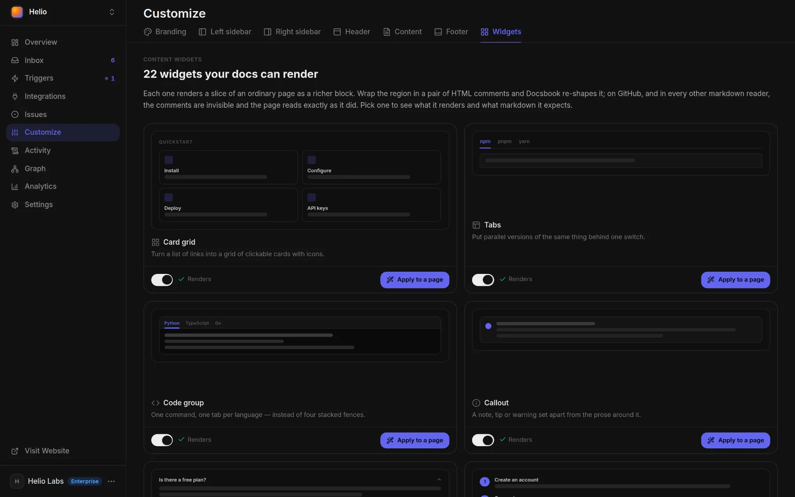

# Page widgets

Wrap plain Markdown in two HTML comments and Docsbook renders it as a card grid, tabs, steps or one of 19 other widgets, while on GitHub the page still reads as ordinary Markdown.

## How a widget marker works

Put an opening comment that names the widget on its own line before the region, and the closing comment on its own line after it:

```markdown
<!-- widget:callout type=tip -->

A custom domain needs one DNS record. See [Custom domain](./custom-domain.md).

<!-- /widget -->
```

On the site, that becomes:

<!-- widget:callout type=tip -->

A custom domain needs one DNS record. See [Custom domain](./custom-domain.md).

<!-- /widget -->

- **Blank lines** — leave one between each marker and the content.
- **Options** — go inside the opening comment, after the name, such as `cols=2 plain` for `cards`; an unknown option is ignored.
- **No nesting** — a widget can't hold another widget.
- **Safe failure** — an unknown name or a missing closing marker leaves the region as plain Markdown, so nothing is ever hidden.

## Every widget

| Widget | What it renders | Use it for |
|---|---|---|
| `cards` | A grid of link cards with icons or images | Hubs, and the "Next steps" at the end of a page |
| `tabs` | Headed sections as one tab strip | The same instructions for different systems, package managers or SDKs |
| `code-group` | Code blocks with a language switcher | One command or call in several languages |
| `callout` | An aside: note, info, tip, success, warning or danger | The sentence a reader must not miss |
| `accordion` | Collapsible rows | FAQs, troubleshooting, reference to scan |
| `stepper` | Numbered, connected steps | A procedure followed in order |
| `pricing` | Plan cards with a Monthly/Annual switch, or a feature comparison with a sticky plan header (`compare`) | Choosing between plans |
| `api` | An endpoint playground with a request form | Letting readers send a real REST call |
| `mcp` | An MCP tool's signature and arguments, with a **Try it** form and a live JSON-RPC and cURL call | Documenting one MCP tool |
| `mcp-connect` | The chat's **MCP** button on the page: Install in Cursor, VS Code or Claude Code, Copy MCP URL, Copy prompt | Letting readers connect your docs to their own agent |
| `endpoints` | A list of calls as index rows: a verb pill, the name, the path and one line | The index page of an API or MCP reference folder |
| `cta` | A compact block with buttons; on a front page, `agents` adds a row of agent chat windows and `inbox` a chat thread over an Inbox | The one next step on a page |
| `cta-form` | The same block with one input field | A next step that starts with an email or a URL |
| `form` | A contact form whose answers reach you by email and as a `form.submitted` event | Enquiries, booking and quote requests |
| `recommendations` | Ranked findings with severity badges | "Fix this first" lists and audit results |
| `hero` | An opener with a lead, quick links and a prompt for the reader's agent; `size=large` or `size=xl` for a front page without a sidebar | A docs home or a section landing page |
| `showcase` | A gallery led by screenshots | Customer sites, templates, examples |
| `stats` | A band of three or four large numbers | Checkable figures on a landing page |
| `journey` | Lifecycle stages, each with destination cards | "Where am I, and what's next" overviews |
| `bento` | Mixed-width feature cards with screenshots | Showing what a product looks like |
| `logos` | A row of customer logos | Social proof under a hero |
| `stories` | Coloured post cards filtered by category chips | A blog or case-study index |
| `story` | A post header with a brand panel, the lead and a fact column | The top of a blog post |
| `quote` | A quotation on a card with the speaker's name and role | A real quote in a post |

Each widget's full contract and a copyable example are in **Customize ▸ Widgets** and in `list_content_widgets`. The **Next steps** block at the end of this page is a `cards` widget.

## Lay out a blog

A blog index and its posts read best without the docs sidebar. Put `layout: landing` in a page's frontmatter and that page drops the sidebar, the on-this-page outline, breadcrumbs, the rating bar and previous/next links; its text keeps a left-aligned reading width.

```markdown
---
title: "Mintlify vs Docsbook"
layout: landing
---
```

Keep each category's posts in their own folder, such as `blog/compare/` and `blog/migrate/`, and give the index one heading per folder inside a `stories` widget: each heading becomes a filter chip, and `?category=compare` opens the index on that chip. Open each post with a `story` widget. This site's [blog](../blog/README.md) is built this way.

## Let readers connect your docs to their agent

An `mcp-connect` widget puts the chat's **MCP** button on the page itself. The menu installs your project's MCP server in Cursor, VS Code or Claude Code in one click, or copies its URL or a ready prompt for any other client:

```markdown
<!-- widget:mcp-connect -->

### Use these docs from your agent

Connect the documentation to Cursor, VS Code or Claude Code over MCP — your agent then searches and quotes these pages instead of guessing.

<!-- /widget -->
```

On the site, that becomes:

<!-- widget:mcp-connect -->

### Use these docs from your agent

Connect the documentation to Cursor, VS Code or Claude Code over MCP — your agent then searches and quotes these pages instead of guessing.

<!-- /widget -->

- **No address to write** — Docsbook fills in your project's own server when the page renders. It is public and read-only: `search`, `read_doc` and `get_doc_outline` over your published pages, no account needed.
- **Your product's own server** — put its `https://` address as a link inside the region, such as `[Acme MCP](https://mcp.acme.dev/mcp)`, and the menu installs that server instead.
- **On GitHub** — the region reads as its heading and sentence.

Or tell your agent: `Add an MCP connect button under the intro of the quickstart.`

## Collect enquiries with a form

A `form` widget turns a bulleted list into a form your readers fill in on the page. Each bullet is one field, its text is the label, and a `*` makes it required:

```markdown
<!-- widget:form name=booking -->

## Request a booking

Tell us your dates and we will confirm within a day.

- Name *
- Email * — you@example.com
- Apartment {select}
  - Studio
  - One bedroom
- Check-in {date} {required}
- Guests {number}
- Anything we should know? {textarea}

[Send request](#)

> **Thanks — request received.** We will email you within one business day.

<!-- /widget -->
```

- **Field types** — `{email}`, `{tel}`, `{number}`, `{date}`, `{url}`, `{textarea}`, `{select}`, `{radio}` or `{checkbox}` on the bullet; a nested list gives a drop-down its options, and text after ` — ` is the placeholder
- **The button** — the link after the list; `#` keeps the reader on the page and shows the quote as the thank-you, any other link is where they go after sending
- **Where answers go** — every submission is emailed to the project owner and fires `form.submitted` for your [triggers and webhooks](../agent/triggers.md); `name=` tells two forms apart

The markdown never holds an email address or an endpoint, so a form can only ever reach the owner of the site it is on. This site's [Enterprise page](../enterprise.md) takes its leads with one.

## Switch a widget off

**Customize ▸ Widgets** shows every widget with a preview and a switch, and all of them are on by default.



- **Off** — the widget's markers are ignored and the region renders as plain Markdown. Your files aren't edited, so switching it back on restores it everywhere.
- **Apply to a page** — turns on click-to-edit on your site, and the next block you click offers that widget first.

## Let the agent pick widgets

The Docsbook agent reads the live catalog with `list_content_widgets` before it writes, and widgets you switched off aren't offered. Every `write_docs` result also carries a `widget_review` that names markers that won't render and regions that should have been a widget.

On the page itself, click a block in [interactive mode](./editing.md) and pick a widget in the inspector's **Widget** section. Or tell your agent:

```text
Turn the install section of the quickstart into code tabs for npm, pnpm and yarn.
End every guide with a Next steps card grid.
Put the setup part of the Webhooks page into numbered steps.
```

## Next steps

<!-- widget:cards plain cols=2 arrow=hover -->

- [Edit and publish](./editing.md) — Interactive mode, GitHub sync and review {pencil}
- [Brand your docs](./branding.md) — Logo, colors, fonts, header and footer {palette}
- [AI writes and updates your docs](../agent/README.md) — How the agent writes and restructures pages {bot}
- [Connect your agent](../get-discovered.md) — Send requests from Claude Code, Cursor or Codex {plug}

<!-- /widget -->
